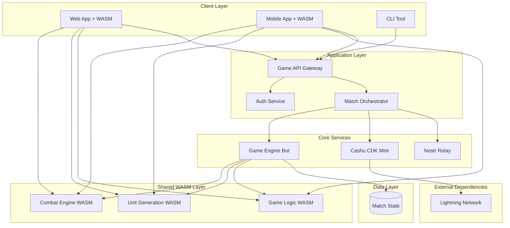

# Mana Strategy Game - System Architecture Overview

## High-Level Architecture

## Core Components

### 1. Client Applications
**Purpose:** User interfaces for game interaction with shared WASM game logic
- **Web App:** React + TypeScript with WASM combat engine
- **Mobile App:** React Native with WASM bindings
- **CLI Tool:** Command-line interface for advanced users

**Key Features:**
- Cashu CDK wallet integration (dual currencies: mana/loot)
- Client-side unit generation from mana token secrets (WASM)
- Real-time combat simulation matching server authority (WASM)
- Match coordination via Nostr events
- Deterministic game logic synchronization

### 1.5. Shared WASM Layer
**Purpose:** Ensures game logic consistency between client and server
- **Combat Engine:** Identical battle resolution on client and server
- **Unit Generation:** Deterministic unit creation from token secrets
- **Game State:** Shared data structures and validation logic

**Technical Implementation:**
- Rust code compiled to WebAssembly using `wasm-pack`
- Shared between Game Engine Bot (native Rust) and Web Client (WASM)
- Eliminates client-server desynchronization issues
- Enables client-side prediction and validation

### 2. Game API Gateway
**Purpose:** Central entry point for all client requests
- Request routing and load balancing
- Authentication and authorization
- Rate limiting and abuse prevention
- API versioning and documentation

### 3. Match Orchestrator
**Purpose:** Coordinates match lifecycle and state management
- Match creation and player pairing
- Round timing and progression
- Event publishing coordination
- Result verification and finalization

### 4. Game Engine Bot
**Purpose:** Authoritative game mechanics using shared WASM logic
- Authoritative match resolution using WASM combat engine
- Unit generation from mana token secrets (WASM)
- League modifier application (WASM)
- Loot token distribution via Cashu mint requests
- Match state management and progression

**WASM Integration:**
- Uses identical combat logic as clients via shared WASM modules
- Ensures deterministic results that clients can predict
- Eliminates need for complex state synchronization

### 5. Cashu CDK Mint
**Purpose:** Pure dual-currency Cashu protocol implementation
- **Mana Currency:** Mint-only tokens (5 mana per sat, no melt)
- **Loot Currency:** Meltable reward tokens (NPub-locked)
- Standard Cashu NUT implementations (NUT-00, NUT-01, NUT-04, NUT-05)
- Lightning Network integration for mana purchases and loot claims
- No game-specific logic (separation of concerns)

### 6. Nostr Relay
**Purpose:** Decentralized event coordination
- Standard Nostr relay implementation (strfry)
- Match announcement and coordination events
- Commitment/reveal protocol coordination
- Result broadcasting and verification
- Player communication and discovery

## Data Flow Architecture

### Match Flow (with WASM Synchronization)
1. **Initiation:** Players purchase mana tokens via Cashu CDK mint
2. **Unit Generation:** Players use WASM to generate units from mana token secrets (client-side)
3. **Match Creation:** Players coordinate match via Nostr events
4. **Commitment Phase:** Players commit to unit selections using cryptographic hashes
5. **Reveal Phase:** Players reveal mana tokens and unit choices
6. **Combat Resolution:** 
   - **Client-side:** WASM combat engine provides immediate visual feedback
   - **Server-side:** Game Engine Bot uses identical WASM logic for authoritative results
7. **Synchronization:** Client predictions match server authority (deterministic WASM)
8. **Rewards:** Game Engine Bot requests loot tokens from Cashu mint for winners

### Event Flow (Nostr)
1. **Match Announcement:** Mint publishes match creation
2. **Unit Commitments:** Players publish commitment hashes
3. **Unit Reveals:** Players reveal unit selections
4. **Round Results:** Mint publishes combat outcomes
5. **Match Completion:** Final results and winner determination
6. **Reward Claims:** Winner claims loot tokens

## Security Architecture

### Cryptographic Components
- **secp256k1:** Digital signatures for Nostr events and token verification
- **BDHKE:** Blind signature scheme for privacy-preserving token issuance
- **SHA-256:** Commitment schemes and token secret hashing
- **VRF:** Verifiable random unit generation

### Trust Model
- **Cashu Mint:** Trusted for token issuance and reward distribution
- **Nostr Relay:** Neutral message passing (events are cryptographically signed)
- **Game Engine:** Deterministic and verifiable game logic
- **Clients:** Verify all cryptographic proofs locally

## Scalability Considerations

### Horizontal Scaling
- **Match Orchestrators:** Multiple instances for concurrent matches
- **Game Engines:** Stateless computation allows easy scaling
- **Nostr Clients:** Multiple relay connections for redundancy

### Performance Targets
- **Token Operations:** < 2 seconds for mint/verify
- **Match Resolution:** < 30 seconds per round
- **VRF Generation:** < 1 second per unit set
- **Nostr Events:** < 1 second publish/retrieve

### Bottleneck Analysis
- **Cashu Mint:** Lightning Network payment processing
- **Nostr Relay:** Event throughput and storage
- **VRF Service:** Cryptographic computation overhead
- **Database:** Tournament state and match history storage