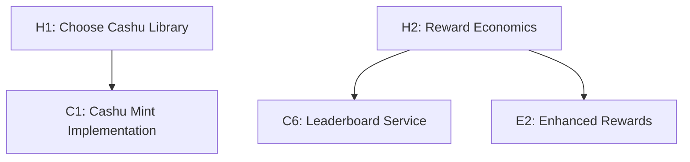
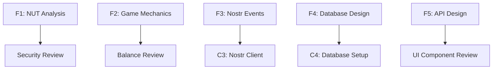

# Mana Strategy Game - Complete Task Board (Human + Agent)

## Task Categories

- 🔴 **HUMAN REQUIRED** - Needs human input/approval before proceeding
- 🟢 **AGENT READY** - Can be completed by Claude agents autonomously  
- 🟡 **HYBRID** - Agent work that requires human review/approval
- 🔵 **IN PROGRESS** - Currently being worked on
- ✅ **COMPLETED** - Finished and approved

## Current Status Board

### 🔴 HUMAN REQUIRED TASKS

| Task ID | Task Name | Human Input Needed | Blocks | Priority |
|---------|-----------|-------------------|--------|----------|
| H1 | Cashu Library Selection | Choose which Rust Cashu crate to use | C1 | Critical |
| H2 | Reward Pool Economics | Define loot token amounts and distribution % | E2 | High |
| H3 | UI/UX Design Approval | Review and approve component mockups | C8 | High |
| H4 | Game Balance Review | Validate unit stats and league modifiers | C2 | Medium |
| H5 | Tournament Period Length | Decide weekly/monthly reward cycles | C6 | Medium |

### 🟢 AGENT READY (No Dependencies)

| Task ID | Task Name | Agent | Deliverable | Can Start |
|---------|-----------|-------|-------------|-----------|
| F1 | Cashu NUT Compliance Analysis | crypto-specialist | NUT requirements matrix | ✅ Now |
| F2 | Game Mechanics Formalization | game-engine | Combat algorithms and rules | ✅ Now |
| F3 | Nostr Event Schema Design | nostr-dev | Event structure definitions | ✅ Now |
| F4 | Database ERD Design | architect | Initial database schema | ✅ Now |
| F5 | API Endpoint Specification | architect | OpenAPI documentation | ✅ Now |

### 🟡 HYBRID TASKS (Agent Work + Human Review)

| Task ID | Task Name | Agent | Human Review Needed | Depends On |
|---------|-----------|-------|-------------------|------------|
| H-F6 | UI Component Specifications | ui-dev | Design approval | F5 (API spec) |
| H-F7 | Security Threat Model | crypto-specialist | Security review | F1 (NUT analysis) |
| H-F8 | Game Balance Parameters | game-engine | Balance validation | F2 (mechanics) |

### 🔵 IN PROGRESS

| Task ID | Task Name | Agent/Human | Started | Progress |
|---------|-----------|-------------|---------|----------|
| | | | | |

### ✅ COMPLETED

| Task ID | Task Name | Completed By | Output |
|---------|-----------|--------------|--------|
| | | | |

## Human Decision Requirements

### H1: Cashu Library Selection (CRITICAL - BLOCKS C1)
**Decision Needed:** Which Rust Cashu implementation to use
**Options to Research:**
- `cashu` crate (if available)
- Custom implementation using `secp256k1` + `sha2`
- Fork existing implementation

**Impact:** Blocks all token-related implementation
**Agent Prep Work:** crypto-specialist can research available options

### H2: Reward Pool Economics  
**Decision Needed:** Loot token amounts and distribution percentages
**Questions:**
- How much loot for match wins? (currently: 1000 loot)
- Seasonal reward pool size?
- Top player percentage (top 10%? top 5%?)
- Minimum games to qualify for rewards?

**Agent Prep Work:** leaderboard-dev can model different scenarios

### H3: UI/UX Design Approval
**Decision Needed:** Approve component designs and user flows
**Process:**
1. ui-dev creates mockups based on game mechanics
2. Human reviews and provides feedback
3. ui-dev revises based on feedback
4. Human gives final approval

### H4: Game Balance Review
**Decision Needed:** Validate unit stat ranges and league modifiers
**Process:**
1. game-engine creates balance model with statistics
2. Human reviews for fairness and fun factor
3. Adjustments made if needed

### H5: Tournament Period Length
**Decision Needed:** How often to distribute seasonal rewards
**Options:** Daily, weekly, monthly, custom periods
**Impact:** Affects player engagement and loot token economics

## Task Dependency Flows

### Immediate Start (Human Decisions)

### Immediate Start (Agent Tasks)

## Agent Assignment Strategy

### Phase 1A: Foundation Research (Start Immediately)
- **crypto-specialist** → F1 (NUT Analysis) + H1 research (Cashu options)
- **game-engine** → F2 (Game Mechanics) + balance modeling for H4
- **nostr-dev** → F3 (Nostr Events)
- **architect** → F4 (Database) + F5 (API Design)
- **leaderboard-dev** → Economic modeling for H2

### Phase 1B: Human Review Cycle
- **Human** → Review H1, H2, H4, H5 decisions
- **ui-dev** → H-F6 (UI Specs) after F5 complete
- **crypto-specialist** → H-F7 (Security Review) after F1 complete

### Phase 1C: Approved Specifications
Only after human approvals can implementation begin.

## Critical Path Analysis

### Human Decision Bottlenecks:
1. **H1 (Cashu Library)** → Blocks C1 → Blocks C6, C7, E2
2. **H3 (UI Approval)** → Blocks C8 → Blocks T2, T3
3. **H2 (Economics)** → Blocks E2 (Enhanced Rewards)

### Fastest Path to Implementation:
1. Agents complete all foundation tasks (F1-F5)
2. Human makes critical decisions (H1, H2, H3)
3. Implementation tasks become unblocked

## Task Readiness Indicators

### 🟢 Ready for Human Review:
- [ ] F1 Complete → H-F7 ready for security review
- [ ] F2 Complete → H-F8 ready for balance review  
- [ ] F5 Complete → H-F6 ready for UI review

### 🟢 Ready for Agent Work:
- [ ] H1 Decided → C1 (Cashu Mint) ready
- [ ] H2 Decided → C6 (Leaderboard) ready
- [ ] H3 Approved → C8 (Frontend) ready

### 🟡 Waiting State:
All implementation tasks wait for human decisions and specification approvals.

## Human Interaction Schedule

### Recommended Review Cycles:
1. **Foundation Review** (After F1-F5 complete): Review all specifications
2. **Implementation Kickoff** (After human decisions): Approve start of coding
3. **Mid-Development Review**: Check progress and adjust if needed
4. **Pre-Testing Review**: Validate completed features
5. **Deployment Approval**: Final go-live decision

This board shows that human decisions are critical gatekeepers for implementation phases, but agents can prepare extensively beforehand!