# Manastr Tutorial Flow - Complete Player-Driven Match Architecture

## Detailed Mermaid Diagram: 9-Phase Zero-Coordination Match Flow

```mermaid
sequenceDiagram
    box rgb(139,69,255) "🎮 Players" P1, P2, NR
        participant P1 as 👤 Alice (Player 1)
        participant P2 as 👤 Bob (Player 2)
    end
    box rgb(0,0,255) "comms" NR
        participant NR as 📡 Nostr Relay
    end
    box rgb(255,153,0) "game authority" GE, CDK
        participant GE as 🎮 Game Engine
        participant CDK as 🏦 Cashu Mint
    end
    
    Note over P1,CDK: 🚀 PHASE 0: Acquire Mana
    P1->>CDK: Request mana tokens for match entry
    CDK->>P1: Mana rewarded
    note over P1: (x, C) are the proof part of a mana token
    note over P1: The player cannot predetermine this value
    note over P1: The blinding is an authorative source of 
    note over P1: randomness where neither mint nore player
    note over P1: are able to have a bias. C will be important.
    note over P1: We also have determinism so can easily have 
    note over P1: deterministic testing. 
    P1->>P1: Unblind mana to resolve C (paired to user generated x)
    Note over P1,CDK: 🚀 PHASE 1: Pick an Army
    P1->>P1: Pick an army
    note over P1: The army is composed of units
    note over P1: We decode units from the 32 bytes 
    note over P1: of C. These units are known to the 
    note over P1: player but no one else. Similar to 
    note over P1: holding cards. Arbitary metaprotocols
    note over P1: could be created when decoding multiples 
    note over P1: of 32 bytes worth of data. MTG style. 
    note over P1: technically speaking, we use the Cashu
    note over P1: keysets for amounts to define decoding
    note over P1: Theming and UI abstracted away too. 
    note over P1: knights? ninjas? Space Marines?
    P1->>P1: Generate army from Cashu C values
    P1->>P1: Create SHA256 commitment of army
    P1->>NR: Publish KIND 31000 (Match Challenge)
    note over P1,CDK: 🌀 Temporal suspension
    NR->>GE: Read KIND 3100 (Match Challenge)
    note over NR,GE: Due to the nature of nostr
    note over NR,GE: These can be stored or even 
    note over NR,GE: created offline. Because of
    note over NR,GE: the commitment we can maintain
    note over NR,GE: a chain of inputs to determine an order.
    note over NR,GE: We will inject GE where it logically lies
    note over NR,GE: but the temporality need not align with the 
    note over NR,GE: players interaction. This allows p2p comms
    note over NR,GE: to be offline during gameplay. But still validatable from the mint
    GE->>GE: Validate challenge format & signature
    GE->>GE: Update match state machine: CHALLENGED
    note over P1,CDK: 🌀 Temporal suspension complete
    note over P1,CDK: ⚔️ Phase 2: Pick a Fight
    P2->>CDK: Request mana tokens for match entry
    CDK->>P2: Mana rewarded
    P2->>P2: Unblind mana to resolve C (paired to user generated x)
    P2->>P2: Pick an army
    P2->>P2: Generate army from Cashu C values
    P2->>P2: Create SHA256 commitment of army
    P2->>NR: Publish KIND 31001 (Match Acceptance)
    note over P1,CDK: 🌀 Temporal suspension
    NR->>GE: Read KIND 31001 (Match Acceptance)
    GE->>GE: Validate challenge format & signature
    GE->>GE: Validate acceptance format & signature
    GE->>GE: Update match state: ACCEPTED
    note over P1,CDK: 🌀 Temporal suspension complete
    Note over P1,CDK: 🔓 PHASE 3: Token Revelation
    Note right of P1: 🎫 Alice reveals actual Cashu tokens<br/>🔍 Allows army verification
    P1->>NR: Publish KIND 31002 (Token Reveal)
    Note right of P2: 🎫 Bob reveals actual Cashu tokens<br/>🔍 Allows army verification  
    P2->>NR: Publish KIND 31002 (Token Reveal)

    NR->>GE: Read KIND 31002 (Token Reveal)
    GE->>CDK: Verify Players' tokens are valid & unspent
    GE->>GE: Re-generate armies from revealed C values
    GE->>GE: Verify armies match commitments
    GE->>GE: Update match state: IN_COMBAT
    
    Note over P1,P2: ⚔️ PHASE 4-6: Combat Simulation (3 Rounds)<br/>A broad scheme of arbitary sequences could be derived.<br/>We illustrate one as an example but do not consider this presepctive.
    loop For each combat round (1-3)
        Note left of P1: The Challenger will always go first<br/> for our example.<br/>Other ordering could be used.
        Note left of P1: 🎲 Alice chooses moves for round<br/>🔐 Commits to moves with SHA256
        P1->>P1: Decide combat moves for all units
        P1->>P1: Create SHA256 commitment of moves  
        P1->>NR: Publish KIND 31003 (Move Commitment)
        
        Note right of P2: Bob sees Alice's move<br🎲 Bob chooses moves for round<br/>🔐 Commits to moves with SHA256<br/>Alice's move commitement is required input.<br/>Perhaps as a tagged hash.
        NR->>P2: Read KIND 31003 (Move Commitment) from Alice
        P2->>P2: Decide combat moves for all units
        P2->>P2: Create SHA256 commitment of moves
        P2->>NR: Publish KIND 31003 (Move Commitment)
        
        NR-->>GE: Read KIND 31003 (Move Commitment)
        GE->>GE: Validate commitment format & sequencing
        GE->>GE: Verify moves match commitments (anti-cheat)
        GE->>GE: Update game state
    end
    
    Note over P1,P2: 🏆 PHASE 7: Match Result Submission
    Note left of P1: 🎯 Alice calculates final outcome<br/>📊 Submits match result
    P1->>P1: Calculate final match state locally
    P1->>NR: Publish KIND 31005 (Match Result)
    Note right of P2: 🎯 Bob calculates final outcome<br/>📊 Must agree with Alice
    P2->>P2: Calculate final match state locally  
    P2->>NR: Publish KIND 31005 (Match Result)
    
    NR-->>GE: Read KIND 31005 (Match Results)
    Note over GE: All players notes should be required for validation
    GE->>GE: Re-execute complete combat using shared logic
    GE->>GE: Verify final state matches player submissions
    
    Note over P1,P2: ✅ PHASE 8: Game Engine Validation
    Note over GE: 🔍 Game Engine re-executes entire match<br/>💰 Drops loot
    GE->>GE: Calculate loot distribution
    GE->>GE: Update match state: COMPLETED
    
    Note over P1,P2: 💰 PHASE 9: Loot Distribution
    Note over GE: 🏦 Game Engine burns mana tokens<br/>🎁 Mints new loot tokens for winner<br/>📡 Publishes authoritative result
    GE->>CDK: Burn Alice's tokens
    GE->>CDK: Burn Bob's tokens
    GE->>CDK: Mint loot tokens for Alice (winner)
    note over GE,CDK: Cashu token use npub locking script to the winner's pubkey
    CDK-->>GE: Loot tokens created successfully
    GE->>NR: Publish KIND 31006 (Loot Distribution)
    
    Note over P1,P2: 🎉 Match Complete - Zero-Coordination Gaming Achieved!
    NR-->>P1: Alice receives loot distribution notification
    NR-->>P2: Bob receives match completion notification
```



## Tutorial Phase Breakdown

### 🔧 **System Architecture Phases**
1. **Pre-Match Setup** - Game Engine CDK mint provides tokens with C values
2. **Player Army Generation** - Deterministic units from Game Engine's C values

### 🎮 **Player-Driven Match Phases** 
3. **Challenge Creation** - Player 1 stakes tokens and commits to army
4. **Challenge Acceptance** - Player 2 matches stake and commits to army  
5. **Token Revelation** - Both players reveal Cashu tokens for verification
6. **Combat Execution** - 3 rounds of cryptographic commitment/reveal
7. **Result Submission** - Players calculate and agree on final outcome
8. **Engine Validation** - Game engine re-executes and validates everything
9. **Loot Distribution** - Automated economic distribution (95%/5% split)

### 🛡️ **Anti-Cheat Mechanisms**
- **C Value Randomness**: Game Engine mint-generated, players cannot manipulate
- **SHA256 Commitments**: Prevent move changing after seeing opponent  
- **Shared WASM Logic**: Identical combat calculation client/server
- **Economic Validation**: 95% player rewards, 5% system fee verification
- **Event Chain Integrity**: Chronological Nostr event validation

### 🏗️ **Revolutionary Architecture Benefits**
- **Zero Trust**: Players don't trust game engine or each other
- **Pure Validation**: Game engine cannot manipulate outcomes  
- **Full Decentralization**: No central authority required
- **Cryptographic Security**: Mathematics prevents all cheating
- **Economic Transparency**: Open source loot distribution model

## Tutorial Mode TUI Design

### 📱 **Main HUD Layout**
```
┌─────────────────────────────────────────────────────────────────────────────┐
│ 🎮 Manastr Tutorial Mode - Zero-Coordination Gaming                         │
├─────────────────────────────────────────────────────────────────────────────┤
│ Phase: [█████████░] 9/9 | Actor: 👤 Alice | State: IN_COMBAT              │
├─────────────────────────────────────────────────────────────────────────────┤
│ Match State:                    │ Current Action:                           │
│ • Challenge ID: abc123...       │ 🔐 Creating move commitment               │
│ • Total Stake: 200 mana         │ ⏳ Waiting for user input...             │  
│ • Combat Round: 2/3             │                                           │
│ • Units Alive: Alice(3) Bob(4)  │                                           │
├─────────────────────────────────────────────────────────────────────────────┤
│ 📋 Step-by-Step Explanation:                                               │
│                                                                             │
│ Alice is now creating her move commitment for combat round 2. In this      │
│ revolutionary architecture, she must:                                       │
│                                                                             │
│ 1. 🎯 Choose tactical moves for each of her 3 remaining units              │
│ 2. 🔐 Create a SHA256 hash commitment of these moves                       │
│ 3. 📡 Publish the commitment to Nostr relay via KIND 31003 event          │
│                                                                             │
│ This commitment/reveal scheme prevents cheating - Alice cannot change      │
│ her moves after seeing Bob's commitment, ensuring fair play through        │
│ cryptographic mathematics rather than trust.                               │
│                                                                             │
│ The game engine acts as a pure validator and cannot manipulate this        │
│ process - it only verifies that moves match commitments later.             │
├─────────────────────────────────────────────────────────────────────────────┤
│ 🎯 Press [ENTER] to continue to next step | [Q] to quit tutorial           │
└─────────────────────────────────────────────────────────────────────────────┘
```

### 🎨 **Actor Indicators**
- 👤 **Player Actions** (Alice/Bob making moves)
- 🎮 **Game Engine** (Validation/Distribution)  
- 📡 **Nostr Relay** (Event forwarding)
- 🏦 **CDK Mint** (Token operations)

### 📊 **Progress Visualization**
- **Phase Progress Bar**: Visual indicator of tutorial progress
- **Match State Panel**: Real-time game state information
- **Action Description**: Detailed explanation of current step
- **Interactive Prompts**: User controls tutorial pacing