# 📋 Revolutionary Zero-Coordination Gaming Protocol
## Complete Technical Specification

This document provides the complete technical specification for the world's first zero-coordination multiplayer gaming protocol, consolidating all implementation details needed to understand or build games using this revolutionary approach.

## 🎯 Core Principles

### Zero-Coordination Gaming Revolution
Traditional multiplayer games require centralized servers that:
- Control match creation and progression
- Can manipulate outcomes or cheat players
- Create single points of failure and censorship
- Violate decentralization principles

**This protocol eliminates these problems through:**
- **👥 Complete Player Control**: Players drive entire match flow via cryptographically-secured actions
- **🎮 Pure Validation Architecture**: Game engine cannot cheat - only validates player-submitted outcomes
- **🔐 Cryptographic Anti-Cheat**: Commitment/reveal scheme prevents all forms of cheating
- **💰 Economic Alignment**: Real token stakes create proper skin-in-the-game dynamics
- **🌐 Perfect Decentralization**: No central authority controls match flow

## 🏗️ Architecture Overview

```mermaid
graph TB
    subgraph "👥 Player-Controlled Layer"
        P1[👤 Player 1<br/>🔑 Nostr Keys<br/>💰 Gaming Wallet<br/>⚔️ Army Generation]
        P2[👤 Player 2<br/>🔑 Nostr Keys<br/>💰 Gaming Wallet<br/>⚔️ Army Generation]
    end
    
    subgraph "🌐 Decentralized Infrastructure"
        Relay[📡 Nostr Relay<br/>📨 Event Broadcasting<br/>💾 Event Persistence]
        
        Mint[🪙 Cashu Mint<br/>🔐 Token Operations<br/>🎲 C Value Generation<br/>🔥 Burn Authority]
        
        Engine[🎮 Game Engine<br/>✅ Pure Validator<br/>🛡️ Anti-Cheat Detection<br/>🏆 Loot Distribution]
    end

    P1 -.->|Nostr Events<br/>KIND 31000-31005| Relay
    P2 -.->|Nostr Events<br/>KIND 31000-31005| Relay
    Engine <-.->|Event Processing<br/>KIND 31006| Relay
    Engine <-->|🔐 Authorized Operations<br/>Token Validation| Mint
    P1 <-->|Mana Minting<br/>C Value Access| Mint
    P2 <-->|Mana Minting<br/>C Value Access| Mint
```



## 📡 Nostr Event Protocol

### 8-Phase Player-Driven Match Lifecycle

The complete match flow consists of 7 Nostr event types (KIND 31000-31006) that enable players to control the entire process:

#### Phase 1: Match Challenge (KIND 31000)
**Purpose**: Player initiates match by publishing challenge  
**Authority**: Any player  
**Required Data**:
```json
{
  "kind": 31000,
  "pubkey": "challenger_pubkey",
  "content": "Revolutionary gaming match challenge",
  "tags": [
    ["d", "unique_match_identifier"], 
    ["wager", "100"],
    ["league", "0"],
    ["army_commitment", "sha256_hash_of_army_data"],
    ["player_count", "2"]
  ]
}
```

#### Phase 2: Match Acceptance (KIND 31001)
**Purpose**: Opponent accepts challenge  
**Authority**: Accepting player  
**Required Data**:
```json
{
  "kind": 31001,
  "pubkey": "acceptor_pubkey",
  "content": "Accepting revolutionary gaming challenge",
  "tags": [
    ["e", "challenge_event_id"],
    ["army_commitment", "sha256_hash_of_army_data"],
    ["acceptance_signature", "cryptographic_signature"]
  ]
}
```

#### Phase 3: Token Revelation (KIND 31002)
**Purpose**: Players reveal Cashu tokens for army verification  
**Authority**: Both players  
**Required Data**:
```json
{
  "kind": 31002,
  "pubkey": "player_pubkey",
  "content": "Revealing Cashu tokens for army verification",
  "tags": [
    ["e", "match_event_id"],
    ["tokens", "cashu_token_1,cashu_token_2"],
    ["nonce", "commitment_nonce"],
    ["army_data", "serialized_army_units"]
  ]
}
```

#### Phase 4: Combat Commitment (KIND 31003)
**Purpose**: Players commit to combat moves  
**Authority**: Both players (per round)  
**Required Data**:
```json
{
  "kind": 31003,
  "pubkey": "player_pubkey",
  "content": "Combat move commitment",
  "tags": [
    ["e", "match_event_id"],
    ["round", "1"],
    ["move_commitment", "sha256_hash_of_moves"]
  ]
}
```

#### Phase 5: Combat Revelation (KIND 31004)
**Purpose**: Players reveal actual combat moves  
**Authority**: Both players (per round)  
**Required Data**:
```json
{
  "kind": 31004,
  "pubkey": "player_pubkey", 
  "content": "Revealing combat moves",
  "tags": [
    ["e", "match_event_id"],
    ["round", "1"],
    ["moves", "serialized_combat_moves"],
    ["nonce", "move_commitment_nonce"]
  ]
}
```

#### Phase 6: Match Result (KIND 31005)
**Purpose**: Players submit agreed match outcome  
**Authority**: Both players  
**Required Data**:
```json
{
  "kind": 31005,
  "pubkey": "player_pubkey",
  "content": "Match outcome submission",
  "tags": [
    ["e", "match_event_id"],
    ["winner", "winner_pubkey"],
    ["final_state", "serialized_game_state"]
  ]
}
```

#### Phase 7: Loot Distribution (KIND 31006)
**Purpose**: Game Engine validates and distributes loot  
**Authority**: ONLY Game Engine  
**Required Data**:
```json
{
  "kind": 31006,
  "pubkey": "game_engine_pubkey",
  "content": "Official loot distribution",
  "tags": [
    ["e", "match_event_id"],
    ["winner", "winner_pubkey"],
    ["loot_amount", "200"],
    ["transaction_id", "mint_transaction_id"],
    ["validation_complete", "true"]
  ]
}
```

### Critical Protocol Rules
1. **Event Ordering**: Events must follow the 7-phase sequence
2. **Cryptographic Binding**: All commitments must be verifiable via reveals
3. **Exclusive Authority**: Only game engine can publish KIND 31006 events
4. **Deterministic Processing**: All participants must reach identical conclusions

## 🪙 Token Economics & Army Generation

### Dual Currency System
The protocol uses a pure Cashu CDK mint with two currencies:

#### Mana Tokens (Gameplay Currency)
- **Conversion Rate**: 5 mana per sat
- **Example**: 1000 sats → 5000 mana tokens
- **System Fee**: 5% retained for loot pool (4750 mana to player)
- **Purpose**: Generate deterministic armies for matches
- **Properties**: Mint-only, cannot be melted back to Lightning

#### Loot Tokens (Reward Currency)
- **Source**: 5% fee from mana purchases forms reward pool
- **Distribution**: Earned by match winners, distributed by game engine
- **Properties**: Meltable back to Lightning, locked to winner's Nostr pubkey
- **Example**: 1000 sat purchase → 250 loot tokens to reward pool

### Army Generation from C Values
**Revolutionary Innovation**: Armies generated from Cashu token C values (unblinded mint signatures)

#### Technical Implementation
```rust
// 🏛️ CANONICAL IMPLEMENTATION: Army generation from Cashu C values
pub fn generate_army_from_cashu_c_value(c_value_bytes: &[u8; 32], league_id: u8) -> [Unit; 4] {
    // Chunk the 256-bit C value into 4 u64 seeds for 4 units
    let unit_seeds = [
        u64::from_le_bytes([c_value_bytes[0], c_value_bytes[1], c_value_bytes[2], c_value_bytes[3],
                           c_value_bytes[4], c_value_bytes[5], c_value_bytes[6], c_value_bytes[7]]),
        u64::from_le_bytes([c_value_bytes[8], c_value_bytes[9], c_value_bytes[10], c_value_bytes[11],
                           c_value_bytes[12], c_value_bytes[13], c_value_bytes[14], c_value_bytes[15]]),
        u64::from_le_bytes([c_value_bytes[16], c_value_bytes[17], c_value_bytes[18], c_value_bytes[19],
                           c_value_bytes[20], c_value_bytes[21], c_value_bytes[22], c_value_bytes[23]]),
        u64::from_le_bytes([c_value_bytes[24], c_value_bytes[25], c_value_bytes[26], c_value_bytes[27],
                           c_value_bytes[28], c_value_bytes[29], c_value_bytes[30], c_value_bytes[31]]),
    ];
    
    // Generate 4 units from the 4 u64 seeds
    [
        generate_unit_from_seed(unit_seeds[0], league_id),
        generate_unit_from_seed(unit_seeds[1], league_id),
        generate_unit_from_seed(unit_seeds[2], league_id),
        generate_unit_from_seed(unit_seeds[3], league_id),
    ]
}
```

#### Anti-Cheat Properties
- **Mint Authority**: Only Cashu mint can generate valid C values through cryptographic signatures
- **Tamper-Proof**: Players cannot forge or manipulate C values without invalidating tokens
- **Provable Fairness**: Army generation is deterministic and verifiable from committed tokens
- **No Player Advantage**: Randomness comes from mint, not player choice
- **Economic Constraint**: Players must spend real mana tokens to generate armies

## 🛡️ Anti-Cheat & Validation Systems

### Multi-Layer Security Architecture

#### Layer 1: Cryptographic Commitments
- **Commitment Scheme**: Players commit to actions via SHA256 hashes before revealing
- **Binding Property**: Commitments cryptographically bind players to specific actions
- **Reveal Validation**: All reveals must match original commitments
- **Timing Protection**: Commitment/reveal prevents strategic information leakage

#### Layer 2: Token Authenticity
- **Mint Signature Verification**: All mana tokens verified with Cashu mint
- **C Value Validation**: Army generation verified against token C values
- **Double-Spend Prevention**: Game engine prevents token reuse across matches
- **Economic Constraints**: Real token stakes prevent Sybil attacks

#### Layer 3: Logic Validation
- **Shared Combat Logic**: Identical deterministic outcomes across all participants
- **Army Consistency**: Generated armies verified against C value determinism
- **Rule Enforcement**: Game engine validates all moves and outcomes
- **State Synchronization**: Complete match state verified for consistency

#### Layer 4: Game Engine Authority
- **Pure Validator Role**: Can only validate outcomes, cannot coordinate or cheat
- **Exclusive Token Authority**: Only game engine can burn mana and mint loot
- **Audit Trail**: Complete logging of all validation decisions
- **Economic Resolution**: Authoritative loot distribution based on validation

### Cheating Detection & Response

#### Detectable Attacks
| Attack Type | Detection Method | Response |
|-------------|------------------|----------|
| **Commitment Violation** | Hash verification failure | Immediate match invalidation |
| **Token Forgery** | Mint signature verification | Match invalidation + logging |
| **Double-Spending** | Token usage tracking | Match invalidation + sanctions |
| **Army Tampering** | C value determinism check | Match invalidation |
| **Logic Manipulation** | Shared logic verification | Match invalidation |
| **Result Manipulation** | Combat outcome verification | Match invalidation |

#### Automatic Responses
- **Match Invalidation**: No loot distribution, tokens burned without reward
- **Event Logging**: Complete audit trail of cheating attempts
- **Pattern Detection**: Multiple violations trigger enhanced monitoring
- **Economic Sanctions**: Forfeiture of tokens used in cheating attempts

## 🧠 Shared Combat Logic

### WASM-Based Synchronization
The protocol uses WebAssembly (WASM) compilation to ensure perfect client-server synchronization:

#### Architecture Benefits
- **Perfect Synchronization**: Identical logic execution across all platforms
- **Client-Side Prediction**: Immediate visual feedback without server round-trips
- **Code Reuse**: Single Rust implementation compiled for both client and server
- **Performance**: Near-native performance in browsers via WASM

#### Core Combat Resolution
```rust
// 🎯 DETERMINISTIC COMBAT: Identical results across all participants
pub fn resolve_combat(
    army1: &[Unit; 4],
    moves1: &[CombatMove; 4],
    army2: &[Unit; 4], 
    moves2: &[CombatMove; 4]
) -> CombatResult {
    let mut result = CombatResult::new();
    
    // Process moves in deterministic order
    for position in 0..4 {
        let interaction = calculate_unit_interaction(
            &army1[position], &moves1[position],
            &army2[position], &moves2[position]
        );
        result.apply_interaction(interaction);
    }
    
    result.determine_round_winner();
    result
}
```

## 🎮 Game Engine Specification

### Pure Validator Role
The game engine operates as a pure validator with these exclusive responsibilities:

#### Core Functions
- **Event Processing**: Monitor and process all Nostr events (KIND 31000-31006)
- **Validation Pipeline**: Verify cryptographic commitments, token authenticity, and logic consistency
- **Anti-Cheat Detection**: Identify and respond to cheating attempts
- **Economic Operations**: Burn mana tokens and distribute loot (exclusive authority)
- **Audit Logging**: Maintain complete records of all validation decisions

#### Critical Limitations
- **Cannot Coordinate**: Cannot initiate or control matches
- **Cannot Manipulate**: Cannot alter player actions or outcomes
- **Cannot Cheat**: All operations are verifiable and auditable
- **Cannot Authorize Players**: Players control their own participation

### Game Engine Authorization System
The mint implements runtime-configurable authorization to ensure only legitimate game engines can perform economic operations:

#### Authorization Configuration
```toml
# game-engine-auth.toml - Hot-reloadable authorization
[[authorized_game_engines]]
name = "Primary Game Engine"
nostr_pubkey_hex = "02abc123..."
active = true

[authorized_game_engines.permissions]
can_burn_mana = true
can_query_spent_status = true  
can_mint_loot = true
max_tokens_per_request = 1000
```

#### Security Features
- **Nostr Signature Verification**: All operations require valid Nostr signatures
- **Runtime Updates**: Authorization can be updated without service restart
- **Granular Permissions**: Fine-grained control over game engine capabilities
- **Rate Limiting**: Protection against abuse via token limits per request

## 🚀 Implementation Requirements

### Protocol Compliance Checklist
For any implementation to be compatible with this protocol:

#### Required Nostr Events
- [ ] Support all 7 event types (KIND 31000-31006)
- [ ] Proper event signing and verification
- [ ] Correct tag structure and content format
- [ ] Event ordering and dependency handling

#### Token Integration
- [ ] Cashu token minting and management
- [ ] C value extraction and army generation
- [ ] Commitment/reveal cryptographic schemes
- [ ] Double-spend prevention mechanisms

#### Combat Logic
- [ ] Shared WASM combat logic integration
- [ ] Deterministic army generation from C values
- [ ] Proper commitment/reveal implementation
- [ ] Result verification and consistency

#### Security Requirements
- [ ] Cryptographic commitment verification
- [ ] Token authenticity validation
- [ ] Anti-cheat detection and response
- [ ] Complete audit logging

### Customization Points
Game developers can customize these aspects while maintaining protocol compliance:

#### Game Rules
- Unit abilities and combat mechanics
- League systems and modifiers
- Victory conditions and scoring
- Economic parameters (within protocol constraints)

#### User Experience
- Client interface and visualization
- Match discovery and social features
- Tournament and leaderboard systems
- Payment and wallet integration

#### Infrastructure
- Nostr relay configuration and scaling
- Cashu mint deployment and management
- Game engine authorization and permissions
- Monitoring and analytics systems

## 🌐 Reference Implementation

This codebase provides a complete reference implementation including:

### Core Services
- **Cashu Mint**: Pure CDK implementation with dual currency support
- **Game Engine**: Complete validation pipeline with anti-cheat detection
- **Nostr Relay**: Event broadcasting and persistence
- **Integration Tests**: Comprehensive test suite demonstrating all protocol features

### Client Libraries
- **Gaming Wallet**: CDK-based wallet with C value access for army generation
- **Shared Logic**: WASM-compiled combat resolution and game state management
- **Nostr Integration**: Event creation, publishing, and monitoring

### Development Tools
- **Integration Runner**: Rust-based service orchestration for testing
- **Configuration Management**: Runtime-configurable authorization and parameters
- **Monitoring**: Health checks, metrics, and audit logging

## 🎯 Revolutionary Achievement

This protocol represents a **fundamental breakthrough in multiplayer game architecture**:

> **"The first multiplayer game where players don't need to trust the game server, because the game server cannot cheat."**

### Industry Impact
- **Eliminates Server Manipulation**: Game servers cannot cheat or manipulate outcomes
- **Reduces Infrastructure Costs**: No need for expensive anti-cheat systems
- **Enables True Ownership**: Players control their assets via cryptographic tokens
- **Creates New Possibilities**: Enables game types impossible with traditional architectures

### Technical Innovation
- **Zero-Coordination Gaming**: First working implementation of player-driven match control
- **Cryptographic Fairness**: Provably fair randomness from mint signatures
- **Economic Alignment**: Real token stakes ensure proper incentives
- **Perfect Decentralization**: No single point of failure or control

**This protocol enables the future of fair, decentralized multiplayer gaming!** 🎉

---

*For visual explanations of these concepts, see the [Diagram Documentation](./diagrams/). To start building your own game, continue to the [Getting Started Guide](./GETTING_STARTED.md).*