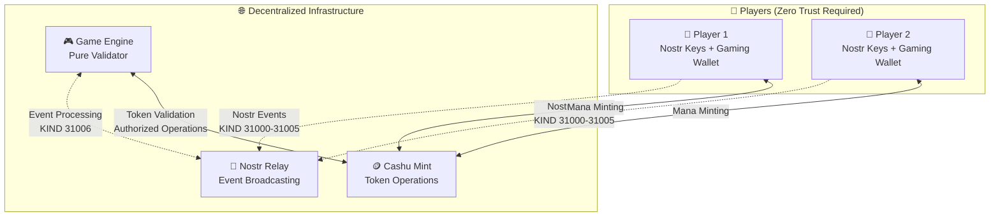

# 🎮 Mana Strategy Game Protocol Documentation
## Revolutionary Zero-Coordination Gaming

Welcome to the documentation for the **world's first zero-coordination multiplayer gaming protocol**. This codebase demonstrates a fundamental breakthrough in multiplayer game design that eliminates the need for trusted game servers while ensuring perfect fairness.

## 🚀 What Makes This Revolutionary?

### Zero-Coordination Gaming
- **👥 Players Control Everything**: Complete match flow driven by player actions via Nostr events
- **🎮 Game Engine Cannot Cheat**: Acts as pure validator, cannot manipulate outcomes or coordinate matches
- **🔐 Perfect Anti-Cheat**: Cryptographic commitment/reveal scheme prevents all forms of cheating
- **💰 Economic Alignment**: Real mana token stakes create proper skin-in-the-game dynamics
- **🌐 Complete Decentralization**: No trusted servers or central coordination required

### Technical Innovations
- **📡 Nostr-First Communication**: All player interactions via decentralized Nostr events
- **🪙 Cashu Token Integration**: Cryptographic C values provide tamper-proof army randomness
- **⚔️ Shared Combat Logic**: Identical deterministic outcomes across all participants
- **🔥 Exclusive Authority**: Only game engine can burn mana tokens after validation
- **🏗️ Rust-First Architecture**: Production-ready cross-platform implementation

## 📚 Documentation Structure

### 🎯 For Understanding the Protocol
| Reference | Purpose | Audience |
|-----------|---------|----------|
| **[Protocol Specification](./PROTOCOL_SPECIFICATION.md)** | Complete technical specification | Protocol implementers, researchers |
| **[Visual Diagrams](./diagrams/)** | Flow charts and architecture diagrams | All audiences, visual learners |

### 🛠️ For Building Games
| Guide | Purpose | Audience |
|-------|---------|----------|
| **[Getting Started](./GETTING_STARTED.md)** | Set up and run the example game | New developers |
| **[Building Your Game](./BUILDING_YOUR_GAME.md)** | Customize and deploy your own game | Game developers |

### 📖 Technical Reference
| Reference | Purpose | Audience |
|-----------|---------|----------|
| **[API Reference](./reference/API_REFERENCE.md)** | Complete API documentation | Advanced developers |
| **[Nostr Events](./reference/NOSTR_EVENTS.md)** | Event schemas and examples | Protocol implementers |
| **[Deployment Guide](./reference/DEPLOYMENT_GUIDE.md)** | Production deployment | DevOps engineers |

## 🎮 Quick Start

Want to see the revolutionary gaming protocol in action?

```bash
# Clone the repository
git clone https://github.com/your-org/manastr.git
cd manastr/daemons

# Run the complete integration test
cargo run --bin integration-runner

# Watch the magic happen:
# ✅ Services start automatically
# ✅ Players create armies from Cashu token randomness  
# ✅ Complete match plays out via Nostr events
# ✅ Game engine validates and distributes loot
# ✅ Zero coordination required!
```

## 🌟 Revolutionary Protocol Features

### 8-Phase Player-Driven Match Lifecycle
1. **👥 Player Creation**: Generate armies from Cashu token C values
2. **⚔️ Match Challenge**: Player publishes challenge via Nostr (KIND 31000)
3. **🤝 Match Acceptance**: Opponent accepts via Nostr (KIND 31001)  
4. **🔓 Token Revelation**: Players reveal tokens for verification (KIND 31002)
5. **⚔️ Combat Rounds**: Commitment/reveal combat via Nostr (KIND 31003/31004)
6. **📊 Match Results**: Players submit outcomes via Nostr (KIND 31005)
7. **🏆 Game Engine Validation**: Engine validates and distributes loot (KIND 31006)
8. **✅ Final Verification**: Complete event chain verified on relay

### Perfect Anti-Cheat System
- **Cryptographic Commitments**: Players commit to actions before revealing
- **Token Authenticity**: All mana tokens verified with Cashu mint
- **Double-Spend Prevention**: Game engine prevents token reuse across matches
- **Deterministic Armies**: Army generation from mint C values cannot be manipulated
- **Shared Logic**: Combat resolution identical across all participants

### Complete Economic Cycle
```
Lightning Sats → Mana Tokens → Army Generation → Combat → Loot Tokens → Lightning Sats
```

## 🏗️ Architecture Overview



## 🎯 Use Cases

### For Game Developers
- **Build Fair Multiplayer Games**: Eliminate server-side cheating and manipulation
- **Reduce Infrastructure Costs**: No need for expensive game servers or anti-cheat systems
- **Enable True Ownership**: Players control their assets via cryptographic tokens
- **Create New Game Types**: Enable games impossible with traditional server architectures

### For Researchers & Engineers
- **Study Zero-Coordination Systems**: Understand breakthrough multiplayer architecture
- **Implement Anti-Cheat Systems**: Learn cryptographic commitment/reveal schemes
- **Explore Decentralized Gaming**: Research implications for gaming industry
- **Analyze Token Economics**: Study economic alignment in multiplayer games

### For Infrastructure Providers
- **Deploy Gaming Networks**: Provide decentralized gaming infrastructure
- **Scale Nostr Services**: Support high-throughput gaming applications
- **Operate Cashu Mints**: Provide token services for gaming ecosystems
- **Build Gaming Tools**: Create tooling for zero-coordination games

## 🔗 Related Resources

### Core Technologies
- **[Nostr Protocol](https://github.com/nostr-protocol/nostr)** - Decentralized event broadcasting
- **[Cashu Protocol](https://github.com/cashubtc/nuts)** - Ecash token system
- **[Lightning Network](https://lightning.network/)** - Bitcoin payment layer
- **[Rust](https://www.rust-lang.org/)** - Systems programming language

### Research & Background
- **[Zero-Coordination Systems](./diagrams/INTEGRATION_TEST_FLOW.md)** - Understanding the breakthrough
- **[Cryptographic Commitment Schemes](./diagrams/ANTI_CHEAT_VALIDATION.md)** - Anti-cheat mechanisms
- **[Decentralized Gaming Economics](./PROTOCOL_SPECIFICATION.md#token-economics)** - Economic model

## 🤝 Contributing

This codebase serves as a **reference implementation** and **educational resource** for revolutionary zero-coordination gaming. We encourage:

- **Protocol Implementations**: Build clients and servers using this protocol
- **Game Development**: Create new games using this foundation
- **Research**: Study and extend the zero-coordination gaming paradigm
- **Documentation**: Improve guides and explanations for other developers

## 🏆 Revolutionary Achievement

This implementation represents a **fundamental breakthrough in multiplayer game architecture**:

> **"The first multiplayer game where players don't need to trust the game server, because the game server cannot cheat."**

By eliminating centralized coordination and using cryptographic proofs, this protocol enables:
- **Perfect fairness** without trusted authorities
- **Complete player control** over match flow
- **Economic alignment** through real token stakes
- **Unprecedented security** via cryptographic anti-cheat

**Welcome to the future of multiplayer gaming!** 🎉

---

*Ready to build the next generation of fair, decentralized multiplayer games? Start with the [Getting Started Guide](./GETTING_STARTED.md)!*