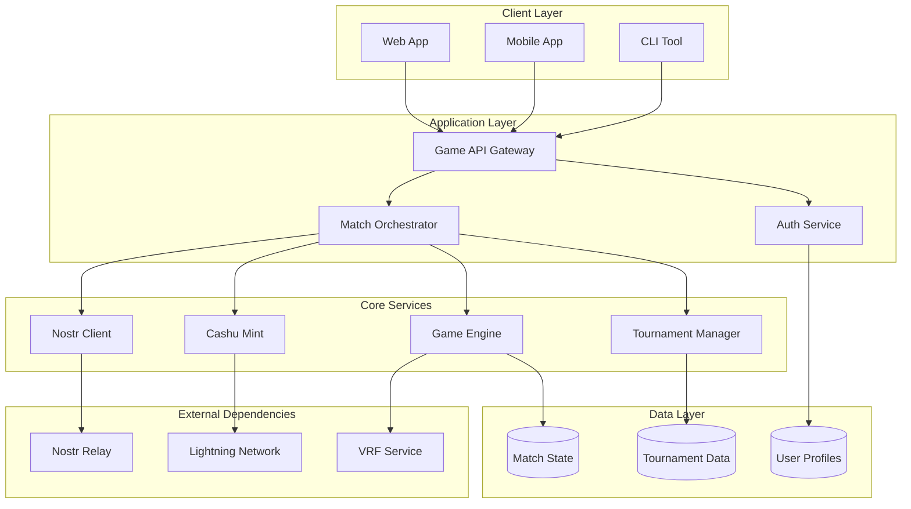

# Mana Strategy Game - System Architecture Overview

## High-Level Architecture

## Core Components

### 1. Client Applications
**Purpose:** User interfaces for game interaction
- **Web App:** Browser-based interface using React
- **Mobile App:** Native iOS/Android apps using React Native
- **CLI Tool:** Command-line interface for advanced users

**Key Features:**
- Mana token purchase interface
- Unit selection and commitment UI
- Match viewing and betting
- Loot claiming and swapping

### 2. Game API Gateway
**Purpose:** Central entry point for all client requests
- Request routing and load balancing
- Authentication and authorization
- Rate limiting and abuse prevention
- API versioning and documentation

### 3. Match Orchestrator
**Purpose:** Coordinates match lifecycle and state management
- Match creation and player pairing
- Round timing and progression
- Event publishing coordination
- Result verification and finalization

### 4. Game Engine
**Purpose:** Core game mechanics and combat resolution
- Unit generation via VRF
- Combat calculation algorithms
- League modifier application
- Betting system logic

### 5. Cashu Mint Service
**Purpose:** Token lifecycle management
- Mana token issuance with 5% fee
- Loot token creation and locking
- Token verification and validation
- Lightning Network integration

### 6. Nostr Client Service
**Purpose:** Asynchronous communication via Nostr protocol
- Event publishing and subscription
- Commitment/reveal coordination
- Match state broadcasting
- Reward claiming events

### 7. Tournament Manager
**Purpose:** Swiss-system tournament coordination
- Player registration and pairing
- Scoring and ranking calculation
- Prize pool management
- Tournament progression logic

## Data Flow Architecture

### Match Flow
1. **Initiation:** Players purchase mana tokens via Cashu
2. **Matching:** Tournament manager pairs players
3. **Setup:** Match orchestrator creates match and publishes announcement
4. **Gameplay:** Players commit/reveal units via Nostr events
5. **Resolution:** Game engine calculates results and publishes outcomes
6. **Rewards:** Cashu mint issues locked loot tokens to winners

### Event Flow (Nostr)
1. **Match Announcement:** Mint publishes match creation
2. **Unit Commitments:** Players publish commitment hashes
3. **Unit Reveals:** Players reveal unit selections
4. **Round Results:** Mint publishes combat outcomes
5. **Match Completion:** Final results and winner determination
6. **Reward Claims:** Winner claims loot tokens

## Security Architecture

### Cryptographic Components
- **secp256k1:** Digital signatures for Nostr events and token verification
- **BDHKE:** Blind signature scheme for privacy-preserving token issuance
- **SHA-256:** Commitment schemes and token secret hashing
- **VRF:** Verifiable random unit generation

### Trust Model
- **Cashu Mint:** Trusted for token issuance and reward distribution
- **Nostr Relay:** Neutral message passing (events are cryptographically signed)
- **Game Engine:** Deterministic and verifiable game logic
- **Clients:** Verify all cryptographic proofs locally

## Scalability Considerations

### Horizontal Scaling
- **Match Orchestrators:** Multiple instances for concurrent matches
- **Game Engines:** Stateless computation allows easy scaling
- **Nostr Clients:** Multiple relay connections for redundancy

### Performance Targets
- **Token Operations:** < 2 seconds for mint/verify
- **Match Resolution:** < 30 seconds per round
- **VRF Generation:** < 1 second per unit set
- **Nostr Events:** < 1 second publish/retrieve

### Bottleneck Analysis
- **Cashu Mint:** Lightning Network payment processing
- **Nostr Relay:** Event throughput and storage
- **VRF Service:** Cryptographic computation overhead
- **Database:** Tournament state and match history storage