# 🛡️ Anti-Cheat & Validation Systems
## Comprehensive Security Architecture for Zero-Coordination Gaming

This document details the multi-layered anti-cheat and validation systems that ensure perfect fairness in the revolutionary gaming protocol.

## 🔒 Multi-Layer Anti-Cheat Architecture

```mermaid
graph TB
    subgraph "🎯 Player Actions"
        PlayerInput[👤 Player Input<br/>• Army Selection<br/>• Move Choices<br/>• Token Commitment]
    end
    
    subgraph "🔐 Cryptographic Layer"
        Commitment[🔒 Commitment Scheme<br/>• SHA256 Hashing<br/>• Nonce Generation<br/>• Reveal Validation]
        
        TokenValidation[🪙 Token Validation<br/>• C Value Verification<br/>• Mint Signature Check<br/>• Double-Spend Detection]
    end
    
    subgraph "🧠 Logic Validation Layer"
        ArmyValidation[⚔️ Army Validation<br/>• Deterministic Generation<br/>• C Value Consistency<br/>• Unit Stat Verification]
        
        CombatValidation[⚔️ Combat Validation<br/>• Shared Logic Execution<br/>• Result Consistency<br/>• Rule Enforcement]
    end
    
    subgraph "🎮 Game Engine Authority"
        MatchValidation[🏆 Match Validation<br/>• Complete Flow Verification<br/>• Economic Resolution<br/>• Loot Distribution]
        
        AuditTrail[📝 Audit Trail<br/>• Event Logging<br/>• Cheating Detection<br/>• Pattern Analysis]
    end
    
    PlayerInput --> Commitment
    PlayerInput --> TokenValidation
    
    Commitment --> ArmyValidation
    TokenValidation --> ArmyValidation
    
    ArmyValidation --> CombatValidation
    CombatValidation --> MatchValidation
    
    MatchValidation --> AuditTrail
    
    %% Failure paths
    Commitment -.->|❌ Invalid| CheatDetected[🚫 Cheat Detected]
    TokenValidation -.->|❌ Invalid| CheatDetected
    ArmyValidation -.->|❌ Invalid| CheatDetected
    CombatValidation -.->|❌ Invalid| CheatDetected
    MatchValidation -.->|❌ Invalid| CheatDetected
    
    CheatDetected --> Invalidate[🚨 Invalidate Match<br/>• No Loot Distribution<br/>• Log Incident<br/>• Flag Player]
    
    %% Styling
    classDef player fill:#e3f2fd,stroke:#1976d2,stroke-width:2px
    classDef crypto fill:#fff3e0,stroke:#f57c00,stroke-width:2px
    classDef logic fill:#f3e5f5,stroke:#4a148c,stroke-width:2px
    classDef engine fill:#e8f5e8,stroke:#1b5e20,stroke-width:2px
    classDef failure fill:#ffebee,stroke:#c62828,stroke-width:2px
    
    class PlayerInput player
    class Commitment,TokenValidation crypto
    class ArmyValidation,CombatValidation logic
    class MatchValidation,AuditTrail engine
    class CheatDetected,Invalidate failure
```



## 🔍 Detailed Validation Flow

### Phase 1: Cryptographic Commitment Validation

```mermaid
sequenceDiagram
    participant Player as 👤 Player
    participant Validator as 🛡️ Validator
    participant Mint as 🪙 Cashu Mint
    
    Note over Player,Mint: 🔒 Commitment Phase
    Player->>Player: Generate army from C values
    Player->>Player: Select moves for round
    Player->>Player: commitment = SHA256(army + moves + nonce)
    Player->>Validator: Send commitment hash
    
    Note over Player,Mint: 📖 Reveal Phase
    Player->>Validator: Reveal army, moves, and nonce
    Validator->>Validator: Verify: SHA256(army + moves + nonce) == commitment
    
    alt Commitment Valid
        Validator->>Mint: Verify tokens authenticity
        Mint-->>Validator: Token validation result
        alt Tokens Valid
            Validator->>Validator: Proceed with combat
        else Tokens Invalid
            Validator->>Validator: 🚫 Invalidate match (fake tokens)
        end
    else Commitment Invalid
        Validator->>Validator: 🚫 Invalidate match (cheating attempt)
    end
```


### Phase 2: Army Generation Validation

```mermaid
flowchart TD
    Start([🏗️ Army Validation Start]) --> ExtractC[📤 Extract C Values]
    
    ExtractC --> ValidateFormat{C Values<br/>Correct Format?}
    ValidateFormat -->|❌ No| InvalidFormat[🚫 Invalid Format<br/>Wrong byte length/encoding]
    ValidateFormat -->|✅ Yes| ChunkValues[🔀 Chunk into 4 u64 Seeds]
    
    ChunkValues --> GenerateArmy[⚔️ Generate Army<br/>Using Shared Logic]
    GenerateArmy --> ValidateArmy{Army Matches<br/>Expected Results?}
    
    ValidateArmy -->|❌ No| ArmyTampering[🚫 Army Tampering<br/>Non-deterministic generation]
    ValidateArmy -->|✅ Yes| ValidateStats[📊 Validate Unit Stats]
    
    ValidateStats --> StatsCheck{Stats Within<br/>Valid Ranges?}
    StatsCheck -->|❌ No| StatsTampering[🚫 Stats Manipulation<br/>Invalid unit properties]
    StatsCheck -->|✅ Yes| ArmyValid[✅ Army Valid<br/>Proceed to Combat]
    
    InvalidFormat --> LogCheat[📝 Log Cheating Attempt]
    ArmyTampering --> LogCheat
    StatsTampering --> LogCheat
    LogCheat --> Failure([❌ Match Invalid])
    
    ArmyValid --> Success([✅ Validation Passed])
    
    %% Styling
    classDef startEnd fill:#e1f5fe,stroke:#01579b,stroke-width:2px
    classDef process fill:#fff3e0,stroke:#f57c00,stroke-width:2px
    classDef decision fill:#fce4ec,stroke:#c2185b,stroke-width:2px
    classDef success fill:#e8f5e8,stroke:#1b5e20,stroke-width:2px
    classDef failure fill:#ffebee,stroke:#c62828,stroke-width:2px
    
    class Start,Success,Failure startEnd
    class ExtractC,ChunkValues,GenerateArmy,ValidateStats,LogCheat process
    class ValidateFormat,ValidateArmy,StatsCheck decision
    class ArmyValid,Success success
    class InvalidFormat,ArmyTampering,StatsTampering,Failure failure
```


### Phase 3: Combat Result Validation

```mermaid
sequenceDiagram
    participant P1 as 👤 Player 1
    participant P2 as 👤 Player 2
    participant Engine as 🎮 Game Engine
    participant SharedLogic as 🧠 Shared Combat Logic
    
    Note over P1,SharedLogic: ⚔️ Combat Execution
    P1->>Engine: Submit combat moves
    P2->>Engine: Submit combat moves
    
    Engine->>SharedLogic: Execute combat with Player 1 perspective
    SharedLogic-->>Engine: Combat result A
    
    Engine->>SharedLogic: Execute combat with Player 2 perspective  
    SharedLogic-->>Engine: Combat result B
    
    Engine->>Engine: Compare results A vs B
    
    alt Results Match
        Engine->>Engine: ✅ Combat valid - deterministic
        Engine->>Engine: Apply results to match state
    else Results Differ
        Engine->>Engine: 🚫 Combat invalid - non-deterministic
        Engine->>Engine: Investigate desynchronization
        alt Shared Logic Bug
            Engine->>Engine: 🔧 Flag for developer review
        else Player Manipulation
            Engine->>Engine: 🚨 Flag potential cheating
        end
        Engine->>Engine: Invalidate match
    end
```


## 🔐 Token Security & Double-Spend Prevention

### Token Lifecycle Tracking


### Double-Spend Detection Algorithm
```rust
// 🛡️ CANONICAL IMPLEMENTATION: Double-spend prevention
pub async fn validate_token_usage(
    mint: &MintClient,
    token_secrets: &[String],
    match_id: &str
) -> Result<ValidationResult, ValidationError> {
    let mut validation_result = ValidationResult::new();
    
    for token_secret in token_secrets {
        // Check if token was already spent in another match
        let spent_status = mint.query_spent_status(token_secret).await?;
        
        if spent_status.is_spent {
            if let Some(previous_match) = spent_status.spent_in_match {
                if previous_match != match_id {
                    // Double-spend detected!
                    validation_result.add_violation(
                        CheatType::DoubleSpend,
                        format!("Token {} already spent in match {}", 
                               token_secret, previous_match)
                    );
                }
            }
        }
        
        // Verify token authenticity with mint
        let authentic = mint.verify_token_signature(token_secret).await?;
        if !authentic {
            validation_result.add_violation(
                CheatType::ForgedToken,
                format!("Token {} failed mint signature verification", token_secret)
            );
        }
    }
    
    Ok(validation_result)
}
```

## 🚨 Cheating Detection Patterns

### Real-Time Anomaly Detection

```mermaid
graph TD
    Events[📡 Nostr Events] --> Analyzer[🔍 Event Analyzer]
    
    Analyzer --> TimeCheck[⏰ Timing Analysis]
    Analyzer --> PatternCheck[🔍 Pattern Analysis] 
    Analyzer --> VolumeCheck[📊 Volume Analysis]
    
    TimeCheck --> TimeAnomaly{Suspicious<br/>Timing?}
    PatternCheck --> PatternAnomaly{Unusual<br/>Patterns?}
    VolumeCheck --> VolumeAnomaly{High<br/>Volume?}
    
    TimeAnomaly -->|Yes| Alert[🚨 Security Alert]
    PatternAnomaly -->|Yes| Alert
    VolumeAnomaly -->|Yes| Alert
    
    Alert --> Investigation[🔍 Automated Investigation]
    Investigation --> Evidence[📋 Gather Evidence]
    Evidence --> Decision{Definitive<br/>Proof?}
    
    Decision -->|Yes| Sanctions[⚖️ Apply Sanctions]
    Decision -->|No| Monitor[👀 Increased Monitoring]
    
    Sanctions --> Ban[🚫 Player Ban]
    Sanctions --> Forfeit[💸 Token Forfeiture]
    
    Monitor --> Analyzer
    
    %% Styling
    classDef input fill:#e3f2fd,stroke:#1976d2,stroke-width:2px
    classDef analysis fill:#fff3e0,stroke:#f57c00,stroke-width:2px
    classDef decision fill:#fce4ec,stroke:#c2185b,stroke-width:2px
    classDef action fill:#e8f5e8,stroke:#1b5e20,stroke-width:2px
    classDef punishment fill:#ffebee,stroke:#c62828,stroke-width:2px
    
    class Events input
    class Analyzer,TimeCheck,PatternCheck,VolumeCheck,Investigation,Evidence analysis
    class TimeAnomaly,PatternAnomaly,VolumeAnomaly,Decision decision
    class Alert,Monitor action
    class Sanctions,Ban,Forfeit punishment
```


### Suspicious Behavior Indicators
| Behavior | Detection Method | Risk Level | Action |
|----------|------------------|------------|--------|
| **Instant Reveals** | Timestamp analysis | 🟡 Medium | Flag for review |
| **Identical Armies** | Army composition comparison | 🔴 High | Investigate C value source |
| **Perfect Win Rate** | Statistical analysis | 🟡 Medium | Enhanced monitoring |
| **Rapid Token Usage** | Volume analysis | 🟠 Medium-High | Rate limiting |
| **Commitment Violations** | Cryptographic verification | 🔴 High | Immediate match invalidation |
| **Forged Tokens** | Mint signature verification | 🔴 High | Permanent ban |
| **Double-Spending** | Token usage tracking | 🔴 High | Economic sanctions |

## 🏛️ Game Engine Validation Authority

### Validation Pipeline Architecture

```mermaid
graph LR
    subgraph "📥 Input Validation"
        EventParsing[📄 Event Parsing<br/>• Nostr format validation<br/>• Required fields check<br/>• Signature verification]
        
        DataSanitization[🧹 Data Sanitization<br/>• Input bounds checking<br/>• SQL injection prevention<br/>• XSS protection]
    end
    
    subgraph "🔐 Cryptographic Validation"
        CommitmentVerification[🔒 Commitment Verification<br/>• Hash validation<br/>• Reveal consistency<br/>• Timing checks]
        
        TokenAuthentication[🪙 Token Authentication<br/>• Mint signature verification<br/>• Double-spend detection<br/>• C value extraction]
    end
    
    subgraph "🧠 Logic Validation"
        ArmyConsistency[⚔️ Army Consistency<br/>• Deterministic generation<br/>• Stat validation<br/>• Rule compliance]
        
        CombatExecution[⚔️ Combat Execution<br/>• Shared logic usage<br/>• Result verification<br/>• State consistency]
    end
    
    subgraph "💰 Economic Validation"
        TokenBurning[🔥 Token Burning<br/>• Authorized operations<br/>• Audit trail creation<br/>• Balance updates]
        
        LootDistribution[💎 Loot Distribution<br/>• Winner verification<br/>• Amount calculation<br/>• Mint operations]
    end
    
    EventParsing --> DataSanitization
    DataSanitization --> CommitmentVerification
    CommitmentVerification --> TokenAuthentication
    TokenAuthentication --> ArmyConsistency
    ArmyConsistency --> CombatExecution
    CombatExecution --> TokenBurning
    TokenBurning --> LootDistribution
    
    %% Styling
    classDef input fill:#e3f2fd,stroke:#1976d2,stroke-width:2px
    classDef crypto fill:#fff3e0,stroke:#f57c00,stroke-width:2px
    classDef logic fill:#f3e5f5,stroke:#4a148c,stroke-width:2px
    classDef economic fill:#e8f5e8,stroke:#1b5e20,stroke-width:2px
    
    class EventParsing,DataSanitization input
    class CommitmentVerification,TokenAuthentication crypto
    class ArmyConsistency,CombatExecution logic
    class TokenBurning,LootDistribution economic
```


### Validation Performance Metrics
| Validation Stage | Target Latency | Success Rate | Error Handling |
|------------------|---------------|--------------|----------------|
| **Event Parsing** | <50ms | 99.9% | Reject malformed events |
| **Commitment Verification** | <100ms | 99.5% | Invalidate cheating attempts |
| **Token Authentication** | <200ms | 99.8% | Reject invalid/fake tokens |
| **Army Validation** | <150ms | 99.9% | Flag generation tampering |
| **Combat Execution** | <500ms | 99.9% | Log non-deterministic results |
| **Economic Operations** | <1000ms | 99.95% | Rollback on mint failures |

## 🔬 Advanced Security Features

### Machine Learning Anomaly Detection
- **Behavioral Profiling**: Player behavior pattern learning
- **Statistical Analysis**: Win rate and timing pattern analysis
- **Network Analysis**: Connection pattern and IP analysis
- **Economic Analysis**: Token usage and accumulation patterns

### Cryptographic Innovations
- **Zero-Knowledge Proofs**: Future enhancement for move privacy
- **Multi-Signature Schemes**: Enhanced security for high-value matches
- **Threshold Cryptography**: Distributed validation for tournament play
- **Homomorphic Encryption**: Private computation on encrypted data

### Audit & Compliance
- **Immutable Audit Logs**: Blockchain-based audit trail storage
- **Regulatory Compliance**: Gaming regulation compliance monitoring
- **Third-Party Audits**: Regular security assessments
- **Bug Bounty Program**: Community-driven security testing

This comprehensive anti-cheat and validation system ensures the revolutionary zero-coordination gaming protocol maintains perfect fairness while preventing all forms of cheating! 🛡️