# 🏛️ Integration Test Flow Diagrams
## Revolutionary Zero-Coordination Gaming Protocol

This document provides comprehensive diagrams showing the flow of the integration test and the revolutionary game protocol it demonstrates.

## 🚀 High-Level Integration Test Flow

```mermaid
flowchart TD
    Start([🚀 Integration Test Start]) --> Services[⚙️ Start Services]
    Services --> |"Cashu Mint<br/>Game Engine<br/>Nostr Relay"| Ready{All Services Ready?}
    
    Ready -->|Yes| Test1[📋 Test 1: Happy Path Match]
    Ready -->|No| Services
    
    Test1 --> Test2[📋 Test 2: Anti-Cheat Verification]
    Test2 --> Test3[📋 Test 3: Concurrent Matches]
    Test3 --> Test4[📋 Test 4: Edge Cases]
    Test4 --> Test5[📋 Test 5: Stress Test]
    
    Test5 --> Success([✅ All Tests Passed])
    
    %% Styling
    classDef startEnd fill:#e1f5fe,stroke:#01579b,stroke-width:2px
    classDef process fill:#f3e5f5,stroke:#4a148c,stroke-width:2px
    classDef test fill:#e8f5e8,stroke:#1b5e20,stroke-width:2px
    
    class Start,Success startEnd
    class Services,Ready process
    class Test1,Test2,Test3,Test4,Test5 test
```



## 🎮 Complete Match Lifecycle (Test 1: Happy Path)


## 🔐 Service Architecture & Communication


## 🔒 Anti-Cheat & Validation Flow

```mermaid
flowchart TD
    Start([🔒 Anti-Cheat Validation]) --> TokenReveal[📤 Player Reveals Tokens]
    
    TokenReveal --> CommitmentCheck{Commitment Hash<br/>Matches Reveal?}
    CommitmentCheck -->|❌ No| InvalidateMatch[🚫 Invalidate Match<br/>Cheating Detected]
    CommitmentCheck -->|✅ Yes| TokenValidation[🔍 Validate Tokens with Mint]
    
    TokenValidation --> MintCheck{Mint Confirms<br/>Token Authenticity?}
    MintCheck -->|❌ No| InvalidateMatch
    MintCheck -->|✅ Yes| DoubleSpendCheck[🔄 Check for Double-Spending]
    
    DoubleSpendCheck --> SpendCheck{Token Already<br/>Spent Elsewhere?}
    SpendCheck -->|✅ Yes| InvalidateMatch
    SpendCheck -->|❌ No| ArmyGeneration[⚔️ Generate Army from C Values]
    
    ArmyGeneration --> ArmyValidation[🛡️ Validate Army Determinism]
    ArmyValidation --> ValidationResult{All Validations<br/>Passed?}
    
    ValidationResult -->|❌ No| InvalidateMatch
    ValidationResult -->|✅ Yes| CombatProcessing[⚔️ Process Combat]
    
    CombatProcessing --> BurnTokens[🔥 Burn Used Mana Tokens<br/>(Game Engine Authority)]
    BurnTokens --> DistributeLoot[💰 Distribute Loot to Winner]
    DistributeLoot --> Success([✅ Match Validated<br/>Loot Distributed])
    
    InvalidateMatch --> LogCheating[📝 Log Cheating Attempt]
    LogCheating --> Failure([❌ Match Invalid<br/>No Loot Distributed])
    
    %% Styling
    classDef startEnd fill:#e1f5fe,stroke:#01579b,stroke-width:2px
    classDef process fill:#fff3e0,stroke:#f57c00,stroke-width:2px
    classDef decision fill:#fce4ec,stroke:#c2185b,stroke-width:2px
    classDef success fill:#e8f5e8,stroke:#1b5e20,stroke-width:2px
    classDef failure fill:#ffebee,stroke:#c62828,stroke-width:2px
    
    class Start,Success,Failure startEnd
    class TokenReveal,TokenValidation,DoubleSpendCheck,ArmyGeneration,ArmyValidation,CombatProcessing,BurnTokens,DistributeLoot,LogCheating process
    class CommitmentCheck,MintCheck,SpendCheck,ValidationResult decision
    class Success success
    class InvalidateMatch,Failure failure
```

## 🌟 Revolutionary Paradigm Features

### ✅ Zero-Coordination Gaming
- **Players Control Everything**: Complete match flow driven by player Nostr events
- **Game Engine Cannot Cheat**: Acts as pure validator, cannot manipulate outcomes
- **No Trusted Servers**: All authority derived from cryptographic proofs

### 🔐 Perfect Anti-Cheat System
- **Commitment/Reveal Scheme**: Prevents strategic cheating via cryptographic binding
- **Mint-Based Randomness**: Army generation from unbiased Cashu token C values
- **Economic Constraints**: Real mana tokens required, preventing Sybil attacks

### 🎯 Complete Economic Cycle
1. **Mana Investment**: Players spend real mana tokens for match participation
2. **Army Generation**: Deterministic armies from cryptographic C values  
3. **Combat Resolution**: Shared logic ensures identical outcomes
4. **Loot Distribution**: Winners receive valuable loot tokens

### 🏗️ Production-Ready Architecture
- **Concurrent Match Support**: Multiple matches processed simultaneously
- **Runtime Authorization**: Hot-swappable game engine permissions
- **Cross-Platform Compatibility**: Rust-first implementation works everywhere
- **Comprehensive Testing**: 5-tier test suite validates all scenarios

## 📊 Test Coverage Summary

| Test Category | Purpose | Key Validations |
|---------------|---------|-----------------|
| **Happy Path** | Complete match lifecycle | All 8 phases, deterministic outcomes |
| **Anti-Cheat** | Commitment verification | Cheating detection, match invalidation |
| **Concurrent** | Multiple matches | Isolated processing, unique armies |
| **Edge Cases** | Malformed events | Error handling, graceful degradation |
| **Stress Test** | High-volume processing | Performance, scalability, reliability |

This represents the **world's first working zero-coordination multiplayer game** with perfect fairness and complete decentralization! 🎉