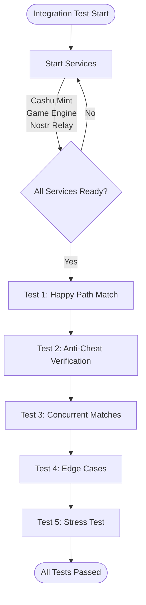
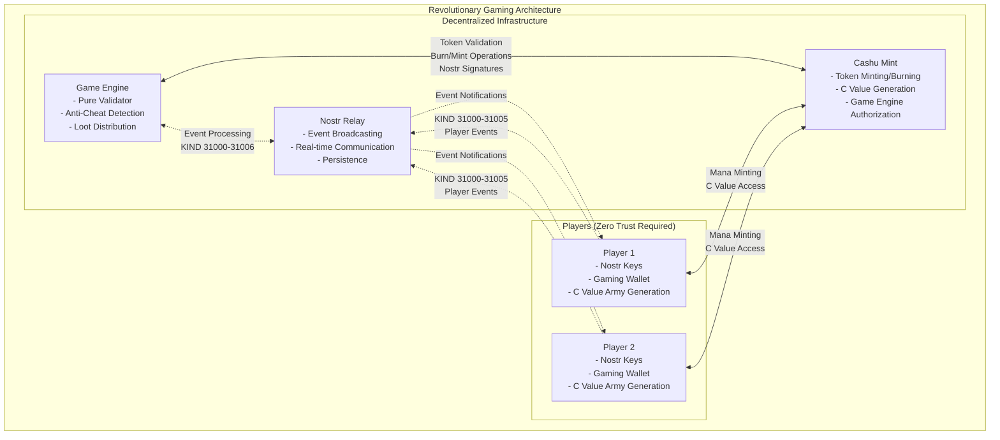
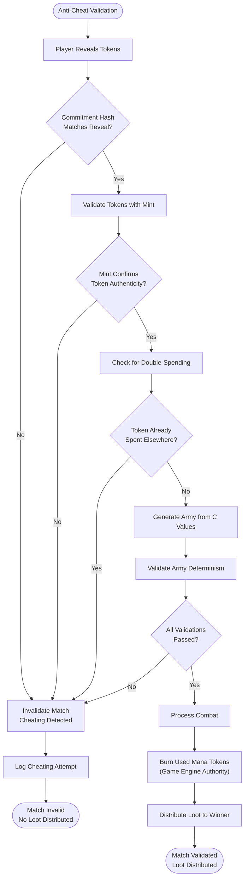

# Integration Test Flow Diagrams
## Revolutionary Zero-Coordination Gaming Protocol

This document provides comprehensive diagrams showing the flow of the integration test and the revolutionary game protocol it demonstrates.

## High-Level Integration Test Flow

## Complete Match Lifecycle (Test 1: Happy Path)

## Service Architecture & Communication

## Anti-Cheat & Validation Flow

## Revolutionary Paradigm Features

### Zero-Coordination Gaming
- **Players Control Everything**: Complete match flow driven by player Nostr events
- **Game Engine Cannot Cheat**: Acts as pure validator, cannot manipulate outcomes
- **No Trusted Servers**: All authority derived from cryptographic proofs

### Perfect Anti-Cheat System
- **Commitment/Reveal Scheme**: Prevents strategic cheating via cryptographic binding
- **Mint-Based Randomness**: Army generation from unbiased Cashu token C values
- **Economic Constraints**: Real mana tokens required, preventing Sybil attacks

### Complete Economic Cycle
1. **Mana Investment**: Players spend real mana tokens for match participation
2. **Army Generation**: Deterministic armies from cryptographic C values  
3. **Combat Resolution**: Shared logic ensures identical outcomes
4. **Loot Distribution**: Winners receive valuable loot tokens

### Production-Ready Architecture
- **Concurrent Match Support**: Multiple matches processed simultaneously
- **Runtime Authorization**: Hot-swappable game engine permissions
- **Cross-Platform Compatibility**: Rust-first implementation works everywhere
- **Comprehensive Testing**: 5-tier test suite validates all scenarios

## Test Coverage Summary

| Test Category | Purpose | Key Validations |
|---------------|---------|-----------------|
| **Happy Path** | Complete match lifecycle | All 8 phases, deterministic outcomes |
| **Anti-Cheat** | Commitment verification | Cheating detection, match invalidation |
| **Concurrent** | Multiple matches | Isolated processing, unique armies |
| **Edge Cases** | Malformed events | Error handling, graceful degradation |
| **Stress Test** | High-volume processing | Performance, scalability, reliability |

This represents the **world's first working zero-coordination multiplayer game** with perfect fairness and complete decentralization!