# ⚔️ Detailed Match Execution & Resolution
## Comprehensive Game Protocol Specification

This document provides nitty-gritty details of how matches execute, including specific Nostr event structures, data flows, and validation logic.

## 📡 Nostr Event Types & Data Structures

### KIND 31000: Match Challenge
```json
{
  "kind": 31000,
  "pubkey": "player1_pubkey",
  "created_at": 1706745600,
  "content": "Match challenge for revolutionary gaming",
  "tags": [
    ["d", "match_event_id"],
    ["wager", "100"],
    ["league", "0"],
    ["army_commitment", "sha256_hash_of_army_data"],
    ["player_count", "2"]
  ]
}
```

### KIND 31001: Match Acceptance
```json
{
  "kind": 31001,
  "pubkey": "player2_pubkey", 
  "created_at": 1706745620,
  "content": "Accepting match challenge",
  "tags": [
    ["e", "challenge_event_id"],
    ["army_commitment", "sha256_hash_of_army_data"],
    ["acceptance_signature", "cryptographic_signature"]
  ]
}
```

### KIND 31002: Token Revelation
```json
{
  "kind": 31002,
  "pubkey": "player_pubkey",
  "created_at": 1706745640,
  "content": "Revealing Cashu tokens for army verification", 
  "tags": [
    ["e", "match_event_id"],
    ["tokens", "cashu_token_1,cashu_token_2"],
    ["nonce", "commitment_nonce"],
    ["army_data", "serialized_army_units"]
  ]
}
```

### KIND 31003: Move Commitment
```json
{
  "kind": 31003,
  "pubkey": "player_pubkey",
  "created_at": 1706745660,
  "content": "Combat move commitment",
  "tags": [
    ["e", "match_event_id"],
    ["round", "1"], 
    ["move_commitment", "sha256_hash_of_moves"],
    ["timestamp", "1706745660"]
  ]
}
```

### KIND 31004: Move Revelation
```json
{
  "kind": 31004,
  "pubkey": "player_pubkey",
  "created_at": 1706745680,
  "content": "Revealing combat moves",
  "tags": [
    ["e", "match_event_id"],
    ["round", "1"],
    ["moves", "serialized_combat_moves"],
    ["nonce", "move_commitment_nonce"]
  ]
}
```

### KIND 31005: Match Result
```json
{
  "kind": 31005,
  "pubkey": "player_pubkey", 
  "created_at": 1706745700,
  "content": "Match outcome submission",
  "tags": [
    ["e", "match_event_id"],
    ["winner", "winner_pubkey"],
    ["final_state", "serialized_game_state"],
    ["signature", "result_signature"]
  ]
}
```

### KIND 31006: Loot Distribution (Game Engine Authority)
```json
{
  "kind": 31006,
  "pubkey": "game_engine_pubkey",
  "created_at": 1706745720,
  "content": "Official loot distribution",
  "tags": [
    ["e", "match_event_id"],
    ["winner", "winner_pubkey"],
    ["loot_amount", "200"], 
    ["transaction_id", "mint_transaction_id"],
    ["validation_complete", "true"]
  ]
}
```

## ⚔️ Detailed Combat Resolution Flow

```mermaid
sequenceDiagram
    participant P1 as 👤 Player 1
    participant P2 as 👤 Player 2  
    participant Shared as 🧠 Shared Game Logic
    participant Engine as 🎮 Game Engine
    participant Mint as 🪙 Cashu Mint

    Note over P1,Mint: 🏗️ Army Generation from C Values
    P1->>Shared: generate_army_from_cashu_c_value(c_bytes, league_id)
    Shared-->>P1: [Unit1, Unit2, Unit3, Unit4]
    P2->>Shared: generate_army_from_cashu_c_value(c_bytes, league_id) 
    Shared-->>P2: [Unit1, Unit2, Unit3, Unit4]

    Note over P1,Mint: ⚔️ Round 1: Position & Ability Selection
    P1->>P1: Select unit positions [0,1,2,3]
    P1->>P1: Select unit abilities ["attack","defend","cast","move"]
    P1->>P1: commitment = sha256(positions + abilities + nonce)
    
    P2->>P2: Select unit positions [3,2,1,0]
    P2->>P2: Select unit abilities ["cast","attack","defend","move"] 
    P2->>P2: commitment = sha256(positions + abilities + nonce)

    Note over P1,Mint: 📡 Commitment Phase
    P1->>Engine: KIND 31003 (Move Commitment)
    P2->>Engine: KIND 31003 (Move Commitment)
    Engine->>Engine: Store commitments for validation

    Note over P1,Mint: 📖 Reveal Phase  
    P1->>Engine: KIND 31004 (Move Reveal: positions=[0,1,2,3], abilities=["attack"...], nonce)
    P2->>Engine: KIND 31004 (Move Reveal: positions=[3,2,1,0], abilities=["cast"...], nonce)
    
    Engine->>Engine: Verify commitment1 == sha256(reveal1)
    Engine->>Engine: Verify commitment2 == sha256(reveal2)
    
    Note over P1,Mint: 🎲 Combat Calculation
    Engine->>Shared: resolve_combat(army1, moves1, army2, moves2)
    Shared->>Shared: Unit 1 attacks Unit 4: damage calculation
    Shared->>Shared: Unit 4 casts spell: area effect
    Shared->>Shared: Unit 2 defends: damage reduction
    Shared->>Shared: Unit 3 moves: position change
    Shared-->>Engine: Combat results + updated unit states

    Note over P1,Mint: 🔄 Additional Rounds (if needed)
    Engine->>Engine: Check win condition
    alt Game continues
        Note over P1,Engine: Repeat commitment/reveal for Round 2, 3...
    else Match complete
        Engine->>Engine: Determine final winner
    end

    Note over P1,Mint: 💰 Economic Resolution
    Engine->>Mint: POST /game-engine/burn-mana (used tokens)
    Mint-->>Engine: Tokens burned successfully
    Engine->>Mint: POST /game-engine/mint-loot (winner rewards)
    Mint-->>Engine: Loot tokens created
    
    Engine->>Engine: KIND 31006 (Official loot distribution)
```



## 🔐 Cryptographic Commitment/Reveal Scheme

```mermaid
flowchart TD
    Start([⚔️ Combat Round Start]) --> Selection[🎯 Player Move Selection]
    
    Selection --> Commitment[🔒 Create Commitment]
    Commitment --> |"commitment = SHA256(<br/>positions + abilities + nonce)"| Store[📦 Store Commitment]
    
    Store --> Wait{Both Players<br/>Committed?}
    Wait -->|No| Store
    Wait -->|Yes| Reveal[📖 Reveal Phase]
    
    Reveal --> Validation[✅ Validate Reveals]
    Validation --> ValidCheck{Commitments<br/>Match Reveals?}
    
    ValidCheck -->|❌ No| Cheating[🚫 Cheating Detected<br/>Invalidate Match]
    ValidCheck -->|✅ Yes| Combat[⚔️ Execute Combat]
    
    Combat --> Results[📊 Calculate Results]
    Results --> WinCheck{Match<br/>Complete?}
    
    WinCheck -->|No| NextRound[🔄 Next Round]
    WinCheck -->|Yes| Victory[🏆 Declare Winner]
    
    NextRound --> Selection
    Victory --> Rewards[💰 Distribute Rewards]
    Rewards --> Success([✅ Match Complete])
    
    Cheating --> LogCheat[📝 Log Cheating Attempt]
    LogCheat --> Failure([❌ Match Invalid])
    
    %% Styling
    classDef startEnd fill:#e1f5fe,stroke:#01579b,stroke-width:2px
    classDef process fill:#fff3e0,stroke:#f57c00,stroke-width:2px
    classDef decision fill:#fce4ec,stroke:#c2185b,stroke-width:2px
    classDef success fill:#e8f5e8,stroke:#1b5e20,stroke-width:2px
    classDef failure fill:#ffebee,stroke:#c62828,stroke-width:2px
    
    class Start,Success,Failure startEnd
    class Selection,Commitment,Store,Reveal,Validation,Combat,Results,NextRound,Victory,Rewards,LogCheat process
    class Wait,ValidCheck,WinCheck decision
    class Success success
    class Cheating,Failure failure
```



## 🧠 Shared Game Logic Integration

### Army Generation Algorithm
```rust
// 🏛️ CANONICAL IMPLEMENTATION: Army generation from Cashu C values
pub fn generate_army_from_cashu_c_value(c_value_bytes: &[u8; 32], league_id: u8) -> [Unit; 4] {
    // Chunk the 256-bit C value into 4 u64 seeds for 4 units
    let unit_seeds = [
        u64::from_le_bytes([c_value_bytes[0], c_value_bytes[1], c_value_bytes[2], c_value_bytes[3],
                           c_value_bytes[4], c_value_bytes[5], c_value_bytes[6], c_value_bytes[7]]),
        u64::from_le_bytes([c_value_bytes[8], c_value_bytes[9], c_value_bytes[10], c_value_bytes[11],
                           c_value_bytes[12], c_value_bytes[13], c_value_bytes[14], c_value_bytes[15]]),
        u64::from_le_bytes([c_value_bytes[16], c_value_bytes[17], c_value_bytes[18], c_value_bytes[19],
                           c_value_bytes[20], c_value_bytes[21], c_value_bytes[22], c_value_bytes[23]]),
        u64::from_le_bytes([c_value_bytes[24], c_value_bytes[25], c_value_bytes[26], c_value_bytes[27],
                           c_value_bytes[28], c_value_bytes[29], c_value_bytes[30], c_value_bytes[31]]),
    ];
    
    // Generate 4 units from the 4 u64 seeds
    [
        generate_unit_from_seed(unit_seeds[0], league_id),
        generate_unit_from_seed(unit_seeds[1], league_id),
        generate_unit_from_seed(unit_seeds[2], league_id), 
        generate_unit_from_seed(unit_seeds[3], league_id),
    ]
}
```

### Combat Resolution Algorithm
```rust
// 🎯 DETERMINISTIC COMBAT: Identical results across all participants
pub fn resolve_combat(
    army1: &[Unit; 4], 
    moves1: &[CombatMove; 4],
    army2: &[Unit; 4],
    moves2: &[CombatMove; 4]
) -> CombatResult {
    let mut result = CombatResult::new();
    
    // Process moves in deterministic order (position-based)
    for position in 0..4 {
        let unit1 = &army1[position];
        let move1 = &moves1[position];
        let unit2 = &army2[position];
        let move2 = &moves2[position];
        
        // Calculate interaction based on unit stats and moves
        let interaction_result = calculate_unit_interaction(unit1, move1, unit2, move2);
        result.apply_interaction(interaction_result);
    }
    
    result.determine_round_winner();
    result
}
```

## 💰 Economic Model & Token Flow

```mermaid
graph LR
    subgraph "💳 Player Wallet"
        Lightning[⚡ Lightning Sats] --> Mint[🪙 Mint Mana Tokens]
        Mint --> ManaTokens[🧿 Mana Tokens<br/>with C Values]
    end
    
    subgraph "⚔️ Match Execution"
        ManaTokens --> ArmyGen[🏗️ Army Generation<br/>from C Values]
        ArmyGen --> Combat[⚔️ Combat Resolution]
        Combat --> Winner{🏆 Winner?}
    end
    
    subgraph "🎮 Game Engine Authority"
        Winner -->|Yes| BurnMana[🔥 Burn Used Mana]
        BurnMana --> MintLoot[💰 Mint Loot Tokens]
        Winner -->|No| BurnOnly[🔥 Burn Mana Only]
    end
    
    subgraph "💎 Loot Distribution"
        MintLoot --> LootTokens[💎 Loot Tokens]
        LootTokens --> Melt[⚡ Melt to Lightning]
        Melt --> Profit[📈 Player Profit]
    end
    
    %% Styling
    classDef wallet fill:#e3f2fd,stroke:#1976d2,stroke-width:2px
    classDef match fill:#fff3e0,stroke:#f57c00,stroke-width:2px
    classDef engine fill:#f3e5f5,stroke:#4a148c,stroke-width:2px
    classDef loot fill:#e8f5e8,stroke:#1b5e20,stroke-width:2px
    
    class Lightning,Mint,ManaTokens wallet
    class ArmyGen,Combat,Winner match
    class BurnMana,MintLoot,BurnOnly engine
    class LootTokens,Melt,Profit loot
```



## 🔍 Game Engine Validation Logic

### Match Validation Pipeline
1. **Event Integrity**: Verify all Nostr events are properly signed and formatted
2. **Commitment Verification**: Ensure commitments match reveals for all players
3. **Token Authenticity**: Validate all mana tokens with the Cashu mint
4. **Double-Spend Prevention**: Check tokens haven't been used in other matches
5. **Army Determinism**: Verify armies generated correctly from C values
6. **Combat Validation**: Re-run combat with shared logic to verify results
7. **Economic Resolution**: Burn mana and distribute loot according to results

### Anti-Cheat Detection Points
- **Token Commitment Mismatch**: Revealed tokens don't match initial commitment
- **Invalid Token Signature**: Cashu tokens fail mint verification  
- **Double-Spending Attack**: Same tokens used in multiple matches
- **Move Commitment Violation**: Revealed moves don't match commitment hash
- **Army Generation Tampering**: Generated army doesn't match C value determinism
- **Result Manipulation**: Combat results don't match shared logic calculation

## 📊 Performance & Scalability

### Concurrent Match Processing
- **Isolated State**: Each match processed in separate state machine
- **Parallel Validation**: Token verification and combat calculation parallelized
- **Event Ordering**: Nostr timestamps ensure consistent event processing
- **Resource Pooling**: Database connections and HTTP clients shared efficiently

### Scaling Characteristics
| Metric | Current Performance | Scaling Strategy |
|--------|-------------------|------------------|
| **Matches/Second** | 5-10 concurrent | Horizontal game engine scaling |
| **Players/Match** | 2 (expandable) | Protocol supports N-player matches |
| **Event Latency** | <1s via Nostr | Distributed relay network |
| **Token Validation** | <100ms per token | Mint caching and batching |

This detailed specification serves as the authoritative guide for implementing the revolutionary zero-coordination gaming protocol! 🎯