# 🏗️ Service Architecture & Communication Patterns
## Revolutionary Zero-Coordination Gaming Infrastructure

This document details the service architecture, communication patterns, and deployment topology for the revolutionary gaming system.

## 🌐 Complete System Architecture

```mermaid
graph TB
    subgraph "🌍 Global Infrastructure"
        subgraph "👥 Player Ecosystem (Decentralized)"
            P1[👤 Player 1<br/>🔑 Nostr Keys<br/>💰 Gaming Wallet<br/>⚔️ Army Generation]
            P2[👤 Player 2<br/>🔑 Nostr Keys<br/>💰 Gaming Wallet<br/>⚔️ Army Generation]
            PN[👤 Player N<br/>🔑 Nostr Keys<br/>💰 Gaming Wallet<br/>⚔️ Army Generation]
        end
        
        subgraph "📡 Nostr Network (Distributed)"
            R1[📡 Relay 1<br/>ws://relay1.example.com]
            R2[📡 Relay 2<br/>ws://relay2.example.com]
            RN[📡 Relay N<br/>ws://relayN.example.com]
        end
        
        subgraph "🏛️ Gaming Infrastructure"
            subgraph "🎮 Game Engine Cluster"
                GE1[🎮 Game Engine 1<br/>🔐 Authorized Keys<br/>⚡ Match Validation<br/>🏆 Loot Distribution]
                GE2[🎮 Game Engine 2<br/>🔐 Authorized Keys<br/>⚡ Match Validation<br/>🏆 Loot Distribution]
            end
            
            subgraph "🪙 Cashu Mint Network"
                M1[🪙 Primary Mint<br/>🔑 Authorization Config<br/>💰 Token Operations<br/>🔥 Burning Authority]
                M2[🪙 Backup Mint<br/>🔑 Authorization Config<br/>💰 Token Operations<br/>🔥 Burning Authority]
            end
            
            subgraph "⚡ Lightning Network"
                LN1[⚡ Lightning Node 1]
                LN2[⚡ Lightning Node 2]
            end
        end
    end

    %% Player ↔ Nostr Communications
    P1 -.->|KIND 31000-31005<br/>WebSocket| R1
    P1 -.->|Redundancy| R2
    P2 -.->|KIND 31000-31005<br/>WebSocket| R2
    P2 -.->|Redundancy| RN
    PN -.->|KIND 31000-31005<br/>WebSocket| RN

    %% Relay Network Synchronization
    R1 <-.->|Event Sync| R2
    R2 <-.->|Event Sync| RN
    R1 <-.->|Event Sync| RN

    %% Game Engine ↔ Infrastructure
    GE1 <-.->|Event Processing<br/>KIND 31000-31006| R1
    GE1 <-.->|Backup Connection| R2
    GE2 <-.->|Event Processing<br/>KIND 31000-31006| R2
    GE2 <-.->|Backup Connection| RN

    %% Mint ↔ Engine Authorization
    GE1 <-->|🔐 Nostr Signed<br/>Token Operations<br/>HTTPS/API| M1
    GE1 <-->|Failover| M2
    GE2 <-->|🔐 Nostr Signed<br/>Token Operations<br/>HTTPS/API| M2
    GE2 <-->|Failover| M1

    %% Player ↔ Mint Token Operations
    P1 <-->|Minting/Melting<br/>HTTPS/API| M1
    P2 <-->|Minting/Melting<br/>HTTPS/API| M2
    PN <-->|Load Balanced<br/>HTTPS/API| M1

    %% Lightning Integration
    M1 <-->|Lightning Payments<br/>BOLT11| LN1
    M2 <-->|Lightning Payments<br/>BOLT11| LN2
    LN1 <-.->|Channel Network| LN2

    %% Styling
    classDef player fill:#e3f2fd,stroke:#1976d2,stroke-width:2px
    classDef nostr fill:#f3e5f5,stroke:#4a148c,stroke-width:2px
    classDef engine fill:#fff3e0,stroke:#f57c00,stroke-width:2px
    classDef mint fill:#e8f5e8,stroke:#1b5e20,stroke-width:2px
    classDef lightning fill:#fff9c4,stroke:#f9a825,stroke-width:2px
    
    class P1,P2,PN player
    class R1,R2,RN nostr
    class GE1,GE2 engine
    class M1,M2 mint
    class LN1,LN2 lightning
```



## 🚀 Service Communication Patterns

### 1. Player-Driven Event Flow

```mermaid
sequenceDiagram
    participant Player as 👤 Player
    participant Relay as 📡 Nostr Relay
    participant Engine as 🎮 Game Engine
    participant Mint as 🪙 Cashu Mint

    Note over Player,Mint: 🎯 Player-Initiated Actions
    Player->>Player: Generate Nostr event (KIND 31000-31005)
    Player->>Relay: Publish event via WebSocket
    Relay->>Engine: Real-time event notification
    Relay->>Player: Confirmation & event ID

    Note over Player,Mint: 🤖 Autonomous Engine Response
    Engine->>Engine: Process event in state machine
    Engine->>Mint: Validate/burn tokens (if needed)
    Mint-->>Engine: Operation confirmation
    Engine->>Relay: Publish response event (KIND 31006)
    Relay->>Player: Notify of engine response
```


### 2. Multi-Relay Redundancy Pattern

```mermaid
graph LR
    Player[👤 Player] --> |Primary| Relay1[📡 Relay 1]
    Player --> |Secondary| Relay2[📡 Relay 2]
    Player --> |Tertiary| Relay3[📡 Relay 3]
    
    Relay1 <-.->|Sync| Relay2
    Relay2 <-.->|Sync| Relay3
    Relay1 <-.->|Sync| Relay3
    
    GameEngine[🎮 Game Engine] --> |Monitor All| Relay1
    GameEngine --> |Monitor All| Relay2
    GameEngine --> |Monitor All| Relay3
```


### 3. Authorization & Security Flow

```mermaid
sequenceDiagram
    participant Engine as 🎮 Game Engine
    participant Config as 📄 Auth Config
    participant Mint as 🪙 Cashu Mint
    
    Note over Engine,Mint: 🔐 Authorization Setup
    Engine->>Engine: Load Nostr private key
    Config->>Mint: game-engine-auth.toml
    Mint->>Mint: Load authorized pubkeys
    
    Note over Engine,Mint: 🔥 Token Operation Request
    Engine->>Engine: Sign request with Nostr key
    Engine->>Mint: POST /game-engine/burn-mana + signature
    Mint->>Mint: Verify signature against authorized keys
    Mint->>Mint: Check permissions & rate limits
    Mint->>Engine: Execute operation & respond
    
    Note over Engine,Mint: 🔄 Runtime Config Updates
    Config->>Mint: Updated auth config detected
    Mint->>Mint: Hot-reload authorization rules
    Mint->>Engine: New permissions take effect immediately
```


## 🔧 Service Configuration & Deployment

### Game Engine Configuration
```toml
[nostr]
private_key = "game_engine_nostr_private_key_hex"
relay_urls = [
    "ws://relay1.example.com",
    "ws://relay2.example.com", 
    "ws://relay3.example.com"
]
event_kinds = [31000, 31001, 31002, 31003, 31004, 31005]

[mint]
primary_url = "https://mint1.example.com"
backup_url = "https://mint2.example.com"
retry_attempts = 3
timeout_seconds = 30

[validation]
max_concurrent_matches = 100
match_timeout_minutes = 60
commitment_reveal_timeout_seconds = 300

[logging]
level = "info"
format = "json"
```

### Cashu Mint Configuration
```toml
[server]
host = "0.0.0.0"
port = 3333
cors_origins = ["*"]

[database]
url = "postgresql://mint:password@db:5432/cashu_mint"
max_connections = 20

[lightning]
backend = "lnd"
connection_string = "127.0.0.1:10009"

[currencies.mana]
unit = "mana"
precision = 0
min_amount = 1
max_amount = 1000000
fee_reserve = 1.0

[currencies.loot]
unit = "loot" 
precision = 0
min_amount = 1
max_amount = 1000000
fee_reserve = 2.0

[authorization]
allow_runtime_updates = true
auth_config_file = "game-engine-auth.toml"

[[authorization.authorized_game_engines]]
name = "Primary Game Engine"
nostr_pubkey_hex = "02abc123..."
active = true

[authorization.authorized_game_engines.permissions]
can_burn_mana = true
can_query_spent_status = true
can_mint_loot = true
max_tokens_per_request = 1000
```

### Docker Deployment Configuration
```yaml
version: '3.8'
services:
  game-engine:
    image: manastr/game-engine:latest
    environment:
      - RUST_LOG=info
      - NOSTR_PRIVATE_KEY=${GAME_ENGINE_NOSTR_KEY}
    volumes:
      - ./config/game-engine.toml:/app/config.toml
    restart: unless-stopped
    deploy:
      replicas: 2
      resources:
        limits:
          memory: 1G
          cpus: '0.5'

  cashu-mint:
    image: manastr/cashu-mint:latest
    environment:
      - RUST_LOG=info
      - DATABASE_URL=${MINT_DATABASE_URL}
    volumes:
      - ./config/mint.toml:/app/mint.toml
      - ./config/game-engine-auth.toml:/app/game-engine-auth.toml
    ports:
      - "3333:3333"
    restart: unless-stopped
    deploy:
      replicas: 2
      resources:
        limits:
          memory: 512M
          cpus: '0.25'

  nostr-relay:
    image: scsibug/nostr-rs-relay:latest
    volumes:
      - ./config/relay.toml:/app/config.toml
      - relay-db:/app/db
    ports:
      - "7777:7777"
    restart: unless-stopped
    deploy:
      resources:
        limits:
          memory: 256M
          cpus: '0.25'

volumes:
  relay-db:
```

## 📊 Monitoring & Observability

### Health Check Endpoints

```mermaid
graph TD
    Monitor[🔍 Monitoring System] --> HealthChecks{Health Checks}
    
    HealthChecks --> MintHealth[🪙 GET /health<br/>Mint Status]
    HealthChecks --> EngineHealth[🎮 Nostr Event Processing<br/>State Machine Status]
    HealthChecks --> RelayHealth[📡 WebSocket Connection<br/>Event Throughput]
    
    MintHealth --> MintMetrics[📊 Mint Metrics<br/>• Tokens minted/burned<br/>• API response times<br/>• Error rates]
    
    EngineHealth --> EngineMetrics[📊 Engine Metrics<br/>• Matches processed<br/>• Validation success rate<br/>• Event latency]
    
    RelayHealth --> RelayMetrics[📊 Relay Metrics<br/>• Event throughput<br/>• Connection count<br/>• Storage utilization]
```


### Key Performance Indicators (KPIs)
| Service | Metric | Target | Alert Threshold |
|---------|--------|--------|-----------------|
| **Game Engine** | Match processing latency | <5s | >10s |
| **Game Engine** | Validation success rate | >99% | <95% |
| **Game Engine** | Concurrent matches | 100+ | N/A |
| **Cashu Mint** | Token operation latency | <1s | >3s |
| **Cashu Mint** | API availability | 99.9% | <99% |
| **Cashu Mint** | Authorization failures | <0.1% | >1% |
| **Nostr Relay** | Event delivery latency | <500ms | >2s |
| **Nostr Relay** | Connection uptime | 99.9% | <99% |
| **Nostr Relay** | Storage growth | <1GB/day | >5GB/day |

## 🔒 Security Architecture

### Network Security
- **TLS Termination**: All HTTPS traffic terminated at load balancer
- **WebSocket Security**: WSS for all Nostr relay connections
- **API Authentication**: Nostr signature verification for all mint operations
- **Rate Limiting**: Per-IP and per-pubkey rate limits on all endpoints
- **DDoS Protection**: Cloud-based DDoS mitigation at edge

### Data Security  
- **Encryption at Rest**: Database encryption for sensitive data
- **Key Management**: HSM or secure key management for Nostr private keys
- **Access Control**: Role-based access control for infrastructure
- **Audit Logging**: Comprehensive audit trails for all operations
- **Backup Security**: Encrypted backups with secure retention policies

### Application Security
- **Input Validation**: Strict validation of all Nostr events and API inputs
- **Authorization Checks**: Multi-layer authorization verification
- **Secure Defaults**: Fail-secure defaults for all configuration
- **Dependency Scanning**: Regular security scanning of all dependencies
- **Penetration Testing**: Regular security assessments of the full system

## 🚀 Scalability & Performance

### Horizontal Scaling Strategy

```mermaid
graph LR
    subgraph "Load Balancer"
        LB[⚖️ Load Balancer<br/>HAProxy/NGINX]
    end
    
    subgraph "Game Engine Cluster"
        GE1[🎮 Engine 1]
        GE2[🎮 Engine 2] 
        GEN[🎮 Engine N]
    end
    
    subgraph "Mint Cluster"
        M1[🪙 Mint 1]
        M2[🪙 Mint 2]
        MN[🪙 Mint N]
    end
    
    subgraph "Database Cluster"
        DB1[(🗄️ Primary DB)]
        DB2[(🗄️ Replica 1)]
        DBN[(🗄️ Replica N)]
    end
    
    LB --> GE1
    LB --> GE2
    LB --> GEN
    
    LB --> M1
    LB --> M2
    LB --> MN
    
    M1 --> DB1
    M2 --> DB2
    MN --> DBN
    
    DB1 -.->|Replication| DB2
    DB1 -.->|Replication| DBN
```


### Performance Optimization
- **Connection Pooling**: Efficient database and HTTP connection management  
- **Caching Strategy**: Redis caching for frequently accessed data
- **Event Batching**: Batched processing of Nostr events for efficiency
- **Async Processing**: Non-blocking I/O throughout the entire stack
- **Resource Limits**: Proper resource limits and circuit breakers

This service architecture enables the revolutionary zero-coordination gaming system to scale globally while maintaining perfect decentralization and security! 🌍