# Local Development Setup - System Daemons

## Overview
Complete local development environment that can be spun up with a single `just` command. All components run on localhost for self-contained testing and development.

## Required Daemons (4 Total - No Database Needed)

**Key Architecture Decision:** All player data stored in Nostr relays, no separate database required.

### 1. Modified Cashu Mint (`cashu-mint-daemon`)
**Purpose:** Token mint using mana/loot instead of Bitcoin  
**Port:** `3333`  
**Base Library:** `cashubtc/cashu` (Rust implementation)  
**Modifications Needed:**
- Replace Bitcoin/Lightning with mana/loot token types
- Stub Lightning Network integration for local testing
- Custom keyset for 16 league-specific keys
- API endpoints for mana purchase and loot distribution

**Key Features:**
- Issues mana tokens (gameplay currency)
- Creates locked loot tokens (rewards)
- Stubbed Lightning invoices (auto-approve for testing)
- League-specific blind signatures

### 2. Local Nostr Relay (`nostr-relay-daemon`)
**Purpose:** Local message passing for match coordination  
**Port:** `7777`  
**Base Library:** `damus-io/strfry` or `nostr-relay-rs`  
**Configuration:**
- WebSocket server at `ws://localhost:7777`
- Stores events for 24 hours (match duration)
- No authentication (local testing)
- Relay info for game-specific event kinds

**Event Storage:**
- Match announcements
- Unit commitments and reveals
- Match results and rewards
- Player challenges

### 3. Game Engine Bot (`game-engine-daemon`)
**Purpose:** Authoritative game logic and match orchestration  
**Port:** `4444` (REST API for status/debug)  
**Authority:** Has admin access to Cashu mint for reward issuance  
**Capabilities:**
- Monitors Nostr relay for match events
- Processes commitments and reveals
- Calculates combat resolution
- Issues loot tokens to winners
- Publishes authoritative match results

**Bot Behavior:**
```rust
// Pseudo-code for game engine bot
async fn main() {
    let nostr_client = NostrClient::connect("ws://localhost:7777").await;
    let cashu_mint = CashuMintClient::connect("http://localhost:3333").await;
    
    // Subscribe to match events
    nostr_client.subscribe(vec![
        Filter::new().kind(1).tag("match_id"),
        Filter::new().kind(1).tag("commitment"),
        Filter::new().kind(1).tag("reveal"),
    ]).await;
    
    // Process events and orchestrate matches
    loop {
        match nostr_client.recv().await {
            Event::Commitment(commitment) => process_commitment(commitment).await,
            Event::Reveal(reveal) => process_reveal_and_resolve_combat(reveal).await,
            // ... other event types
        }
    }
}
```

### 4. Web Game Client (`web-client-daemon`)
**Purpose:** Combined game interface + Cashu wallet  
**Port:** `8080`  
**Technology:** React SPA with integrated Cashu wallet  
**Base Libraries:**
- `cashubtc/cashu-ts` for wallet functionality
- `nostr-tools` for Nostr client functionality
- React for game UI

**Integrated Features:**
- Cashu wallet for mana/loot management
- Nostr key pair generation and management
- Game lobby and player matching
- Match viewing and unit selection
- Real-time match updates via Nostr events

**Wallet Functionality:**
```typescript
// Integrated Cashu wallet
class ManaWallet {
  async purchaseMana(amount: number): Promise<ManaToken[]> {
    // Create stubbed Lightning invoice
    // Call local Cashu mint for token creation
  }
  
  async claimLoot(lootToken: LootToken): Promise<void> {
    // Verify token is locked to our npub
    // Process loot claim via Cashu mint
  }
}
```

### Internal Storage (Lightweight)
**Cashu Mint Storage:** SQLite or memory-based for token state (internal to mint)  
**Game Data Storage:** All player data, matches, and stats stored as Nostr events  
**No Separate Database:** Nostr relay provides all persistent storage needs

## System Architecture Diagram

```mermaid
graph TB
    subgraph "Local Development Environment (4 Daemons)"
        WEB[Web Client :8080<br/>React + Cashu Wallet]
        RELAY[Nostr Relay :7777<br/>strfry/nostr-relay-rs<br/>📀 Stores all game data]
        ENGINE[Game Engine Bot :4444<br/>Rust Daemon]
        MINT[Cashu Mint :3333<br/>Modified cashubtc/cashu<br/>💾 Internal SQLite only]
    end
    
    WEB <-->|WebSocket<br/>Game Events| RELAY
    ENGINE <-->|WebSocket<br/>Event Processing| RELAY
    ENGINE <-->|HTTP<br/>Token Operations| MINT
    WEB <-->|HTTP<br/>Wallet Operations| MINT
```



## Justfile Configuration

### `justfile` (Project Root)
```make
# Start complete local development environment (4 daemons)
dev:
    #!/usr/bin/env bash
    echo "🚀 Starting Mana Strategy local development environment..."
    echo "📡 Starting Nostr relay (stores all game data)..."
    
    # Start Nostr relay (provides all data persistence)
    just start-nostr-relay &
    sleep 2
    
    # Start Cashu mint 
    just start-cashu-mint &
    sleep 2
    
    # Start game engine bot
    just start-game-engine &
    sleep 2
    
    # Start web client
    just start-web-client &
    
    echo "✅ All 4 daemons started successfully!"
    echo "🎮 Game available at http://localhost:8080"
    echo "📊 Game Engine status: http://localhost:4444/status"
    echo "🏦 Cashu Mint API: http://localhost:3333"
    echo "📡 Nostr Relay: ws://localhost:7777"
    echo "📀 All game data stored in Nostr relay (no separate database)"
    
    # Wait for user to stop
    read -p "Press Enter to stop all services..."
    just stop

start-nostr-relay:
    cd daemons/nostr-relay && ./strfry relay

start-cashu-mint:
    cd daemons/cashu-mint && cargo run --release

start-game-engine:
    cd daemons/game-engine && cargo run --release

start-web-client:
    cd daemons/web-client && npm run dev

stop:
    #!/usr/bin/env bash
    echo "🛑 Stopping all 4 daemons..."
    pkill -f "strfry"
    pkill -f "cashu-mint"
    pkill -f "game-engine"
    pkill -f "web-client"
    echo "✅ All services stopped"

# Individual service management
restart-engine:
    pkill -f "game-engine"
    just start-game-engine &

restart-mint:
    pkill -f "cashu-mint"
    just start-cashu-mint &

# Development helpers
logs-engine:
    tail -f logs/game-engine.log

logs-mint:
    tail -f logs/cashu-mint.log

test-integration:
    #!/usr/bin/env bash
    echo "🧪 Running integration tests..."
    cd tests && python test_full_system.py

reset-data:
    #!/usr/bin/env bash
    echo "🗑️  Resetting all game data..."
    echo "⚠️  Stopping Nostr relay to clear stored events..."
    pkill -f "strfry"
    rm -rf daemons/nostr-relay/data/*
    just start-nostr-relay &
    echo "✅ Nostr relay data reset complete"
```

## Required Libraries and Dependencies

### Cashu Mint Modifications
**Base Repository:** `https://github.com/cashubtc/cashu`  
**Fork Needed:** Custom fork with mana/loot token types  
**Key Changes:**
```rust
// Custom token types instead of Bitcoin amounts
#[derive(Debug, Clone, Serialize, Deserialize)]
pub enum TokenType {
    Mana { league_id: u8 },
    Loot { locked_to_npub: String, amount: u64 },
}

// Stubbed Lightning integration
pub struct StubbedLightning {
    // Auto-approve all payment requests for local testing
}
```

### Nostr Relay
**Options:**
1. `https://github.com/damus-io/strfry` (C++, production-ready)
2. `https://github.com/scsibug/nostr-rs-relay` (Rust alternative)

**Configuration:**
```toml
# relay-config.toml
[relay]
name = "Mana Strategy Local Relay"
port = 7777
max_connections = 100

[storage]
type = "memory"  # For local testing
retention_hours = 24
```

### Web Client Stack
**Base Libraries:**
- `@cashu/cashu-ts` - TypeScript Cashu wallet
- `nostr-tools` - Nostr client library
- `@nostr-dev-kit/ndk` - Advanced Nostr functionality
- React + TypeScript for UI

## Definition of Done

### MVP Success Criteria
✅ **Single Command Startup:**
```bash
just dev
# All 5 daemons start successfully
# Web client accessible at localhost:8080
```

✅ **Self-Play Capability:**
- User can create two browser tabs/windows
- Generate different Nostr key pairs in each
- Challenge themselves and complete a full match
- Mana purchase, unit commitment/reveal, combat resolution
- Loot token reward to winner

✅ **Complete Match Flow:**
1. **Setup:** Player purchases mana token via web client
2. **Challenge:** Player challenges themselves (different browser tab)
3. **Match:** Both sides commit and reveal units
4. **Resolution:** Game engine bot processes combat
5. **Reward:** Winner receives loot token
6. **Verification:** All events visible in Nostr relay logs

✅ **Local Integration:**
- All components communicate via localhost
- No external dependencies (stubbed Lightning)
- Database persists match history
- Logs available for debugging

### Acceptance Test Script
```python
# tests/test_mvp_complete.py
def test_full_local_system():
    # 1. Start all daemons
    subprocess.run(['just', 'dev'])
    
    # 2. Wait for services to be ready
    wait_for_service('http://localhost:8080')
    wait_for_service('http://localhost:3333')
    wait_for_service('ws://localhost:7777')
    
    # 3. Simulate two-player self-play
    player1 = create_test_player()
    player2 = create_test_player()
    
    # 4. Complete match workflow
    match_id = player1.challenge(player2)
    player2.accept_challenge(match_id)
    
    # 5. Play match to completion
    result = play_complete_match(player1, player2)
    
    # 6. Verify winner received loot
    assert result.winner_loot_balance > 0
    
    # 7. Verify all events in Nostr relay
    events = get_nostr_events(match_id)
    assert len(events) >= 6  # announcement, 2 commits, 2 reveals, result
```

This local development setup provides a complete, self-contained environment for building and testing the Mana Strategy Game!