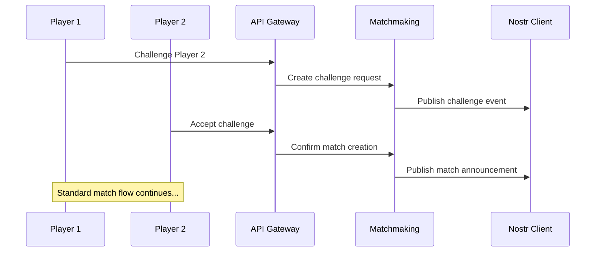
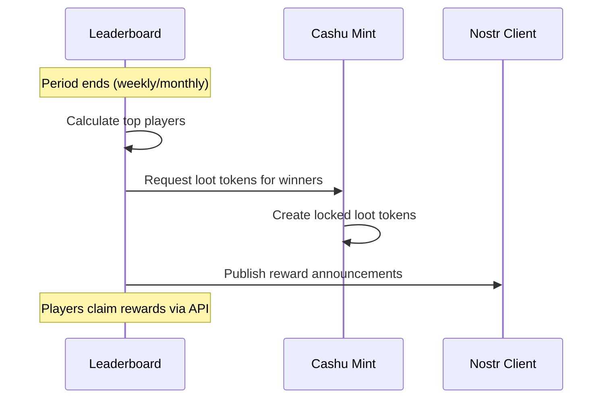

# Simplified Mana Strategy Game Architecture

## System Overview (Revised)

**Key Changes:**
- ❌ Remove Swiss tournament system complexity
- ✅ Player-choice matchmaking (challenge any player)
- ✅ Periodic leaderboard with top-score rewards
- ✅ Simplified match flow and reward distribution

## Core Services (Rust Backend)

### 1. Cashu Mint Integration (`cashu-mint/`)
**Unchanged** - Token minting and loot distribution
- Mana token purchase (5% Lightning fee)
- Loot token creation and melting
- Token verification

### 2. Game Engine (`game-engine/`)  
**Unchanged** - Pure game mechanics
- Unit generation from token secrets
- Combat resolution
- Match state management

### 3. Nostr Client (`nostr-client/`)
**Unchanged** - Asynchronous match coordination  
- Match announcements
- Commitment/reveal events
- Result broadcasting

### 4. Matchmaking Service (`matchmaking/`) **[REPLACES TOURNAMENT SYSTEM]**
**Purpose:** Player-driven match creation and coordination
- Player challenge system
- Open lobby management
- Match history tracking
- Player availability status

### 5. Leaderboard Service (`leaderboard/`) **[NEW SERVICE]**
**Purpose:** Ranking and periodic reward distribution
- Real-time player rankings
- Seasonal/periodic score tracking
- Top-player reward calculation
- Historical statistics

### 6. API Gateway (`api-gateway/`)
**Simplified** - Remove tournament complexity
- Match creation and joining
- Player stats and rankings
- Reward claiming

## Simplified Game Flow

### Match Creation Flow


### Leaderboard & Rewards Flow


## Updated Work Breakdown Structure

### Phase 2: Core Development (6 weeks) **[REDUCED FROM 8 WEEKS]**

#### WP2.1-2.3: Unchanged
- Cashu Mint Integration (12 days)
- Game Engine Core (10 days)  
- Nostr Client Integration (8 days)

#### WP2.4: Matchmaking Service (8 days) **[REPLACES TOURNAMENT WP]**
**Agent:** `matchmaking-dev` (replaces `tournament-dev`)
**Output:** `/implementation/matchmaking/` (complete service)

**Deliverables:**
- [ ] Player challenge system (send/accept/decline)
- [ ] Open lobby for available players
- [ ] Match history and statistics tracking
- [ ] Player rating system (ELO-based)
- [ ] Anti-spam and rate limiting

**Agent Tasks:**
```rust
// src/challenges.rs
pub struct Challenge {
    pub challenger: PlayerId,
    pub challenged: PlayerId,
    pub created_at: DateTime<Utc>,
    pub status: ChallengeStatus, // Pending, Accepted, Declined, Expired
}

// src/lobby.rs  
pub struct PlayerLobby {
    pub available_players: Vec<Player>,
    pub active_matches: Vec<Match>,
}

// src/ratings.rs
pub fn update_player_rating(winner: &Player, loser: &Player) -> (u32, u32) {
    // ELO rating calculation
}
```

#### WP2.5: Leaderboard Service (6 days) **[NEW SERVICE]**
**Agent:** `leaderboard-dev` (new agent role)
**Output:** `/implementation/leaderboard/` (complete service)

**Deliverables:**
- [ ] Real-time player rankings calculation
- [ ] Periodic season management (weekly/monthly)
- [ ] Top-player reward distribution logic
- [ ] Historical statistics and analytics
- [ ] Leaderboard API endpoints

**Agent Tasks:**
```rust
// src/rankings.rs
pub struct PlayerRanking {
    pub player_id: PlayerId,
    pub wins: u32,
    pub losses: u32,
    pub rating: u32,
    pub loot_earned: u64,
}

// src/seasons.rs
pub struct Season {
    pub id: SeasonId,
    pub start_date: DateTime<Utc>,
    pub end_date: DateTime<Utc>,
    pub reward_pool: u64,
}

// src/rewards.rs
pub fn calculate_season_rewards(rankings: &[PlayerRanking], pool: u64) -> Vec<Reward> {
    // Top 10% get rewards, scaled by rank
}
```

#### WP2.6: API Gateway (4 days) **[SIMPLIFIED]**
**Agent:** `architect`
**Simplified endpoints:**
```yaml
/api/v1/players:
  GET /{id}/stats        # Player statistics
  GET /leaderboard       # Current rankings
  
/api/v1/matches:
  POST /challenge        # Challenge another player
  POST /{id}/accept      # Accept challenge
  GET /lobby            # View available players
  
/api/v1/rewards:
  GET /current          # Current season rewards
  POST /claim           # Claim loot rewards
```

#### WP2.7: Frontend Updates (8 days) **[SIMPLIFIED]**
**Agent:** `ui-dev`
**Simplified UI Components:**
- `PlayerLobby` - Browse and challenge players
- `ChallengeManager` - Send/receive/manage challenges  
- `Leaderboard` - Rankings and seasonal stats
- `MatchHistory` - Personal match history
- `RewardCenter` - Claim seasonal loot rewards

### Phase 3: Leaderboard & Rewards (2 weeks) **[REDUCED FROM 4 WEEKS]**

#### WP3.1: Advanced Leaderboard Features (5 days)
- Multi-timeframe rankings (daily, weekly, monthly, all-time)
- Player statistics dashboard
- Matchup history between specific players
- Performance analytics and trends

#### WP3.2: Reward System Integration (5 days)  
- Automated seasonal reward distribution
- Customizable reward tiers and percentages
- Bonus rewards for streaks and achievements
- Integration with Cashu loot token creation

#### WP3.3: Social Features (4 days)
- Friend lists and preferred opponents
- Player profiles and achievements
- Match replay and sharing
- Community leaderboards and groups

## Removed Complexity

### ❌ No Longer Needed:
- Swiss pairing algorithms
- Tournament bracket management
- Complex scheduling systems
- Round-robin coordination
- Tournament director roles
- Multi-stage elimination systems

### ✅ Simplified Implementation:
- Direct player-to-player challenges
- Real-time matchmaking
- Flexible reward periods
- Organic community formation
- Reduced coordination overhead

## Updated Timeline

**Total Project Time: 16 weeks** (reduced from 20 weeks)

- **Phase 1:** Requirements & Design (2 weeks)
- **Phase 2:** Core Development (6 weeks) 
- **Phase 3:** Leaderboard & Rewards (2 weeks)
- **Phase 4:** Testing & Refinement (4 weeks)
- **Phase 5:** Deployment (2 weeks)

## Code References Still Needed

**Only 1 reference required now:**
1. **Cashu Rust Integration** - Library usage and token parsing

**✅ No longer needed:**
- ~~Swiss tournament algorithms~~
- ~~Complex tournament management~~

This simplified architecture is much more achievable and maintainable while preserving all the core game mechanics and cryptographic features!