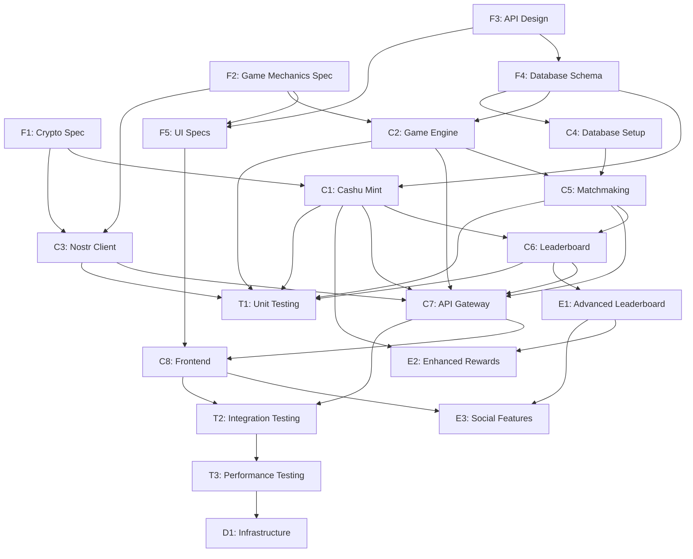

# Mana Strategy Game - Task Dependency Graph

## Claude-Enabled Waterfall Approach

**Key Principle:** Each task has clear prerequisites and deliverables. Claude agents can work on any task whose dependencies are satisfied.

## Phase 1: Foundation Tasks (No Dependencies)

### F1: Cryptographic Specification
**Agent:** crypto-specialist  
**Prerequisites:** None  
**Input:** `spec.md`  
**Output:** `/docs/specifications/crypto_requirements.md`  
**Deliverable:** Complete Cashu NUT compliance matrix and implementation requirements

### F2: Game Mechanics Specification  
**Agent:** game-engine  
**Prerequisites:** None  
**Input:** `spec.md` Section 5  
**Output:** `/docs/specifications/game_mechanics.md`  
**Deliverable:** Formalized combat rules, unit generation, and state machine

### F3: API Design Specification
**Agent:** architect  
**Prerequisites:** None (can work in parallel with F1, F2)  
**Input:** System architecture overview  
**Output:** `/docs/specifications/api_spec.yaml`  
**Deliverable:** Complete OpenAPI 3.0 specification

### F4: Database Schema Design
**Agent:** architect  
**Prerequisites:** F3 (API design)  
**Input:** API specifications  
**Output:** `/docs/specifications/database_schema.sql`  
**Deliverable:** PostgreSQL DDL with all tables and relationships

### F5: UI Component Specifications
**Agent:** ui-dev  
**Prerequisites:** F2 (game mechanics), F3 (API design)  
**Input:** Game mechanics and API specs  
**Output:** `/design/component_library.md`  
**Deliverable:** React component interfaces and user flows

## Phase 2: Core Implementation Tasks

### C1: Cashu Mint Service
**Agent:** crypto-specialist  
**Prerequisites:** F1 (crypto spec), F4 (database schema)  
**Input:** Crypto requirements and database design  
**Output:** `/implementation/cashu-mint/` (working Rust service)  
**Deliverable:** Token minting, verification, and loot distribution

**Can Start When:** F1 AND F4 are complete

### C2: Game Engine Service
**Agent:** game-engine  
**Prerequisites:** F2 (game mechanics), F4 (database schema)  
**Input:** Game mechanics spec and database design  
**Output:** `/implementation/game-engine/` (working Rust service)  
**Deliverable:** Unit generation, combat resolution, match management

**Can Start When:** F2 AND F4 are complete

### C3: Nostr Client Service
**Agent:** nostr-dev  
**Prerequisites:** F1 (crypto spec), F2 (game mechanics)  
**Input:** Event schemas and game flow requirements  
**Output:** `/implementation/nostr-client/` (working Rust service)  
**Deliverable:** Event publishing, subscription, and validation

**Can Start When:** F1 AND F2 are complete

### C4: Database Setup
**Agent:** architect  
**Prerequisites:** F4 (database schema)  
**Input:** Database schema SQL  
**Output:** `/implementation/database/` (migrations and setup)  
**Deliverable:** Working PostgreSQL database with all tables

**Can Start When:** F4 is complete

### C5: Matchmaking Service
**Agent:** matchmaking-dev  
**Prerequisites:** C2 (game engine), C4 (database)  
**Input:** Game engine interfaces and database  
**Output:** `/implementation/matchmaking/` (working Rust service)  
**Deliverable:** Challenge system, lobby, and ELO ratings

**Can Start When:** C2 AND C4 are complete

### C6: Leaderboard Service
**Agent:** leaderboard-dev  
**Prerequisites:** C5 (matchmaking), C1 (Cashu mint)  
**Input:** Match results and reward integration  
**Output:** `/implementation/leaderboard/` (working Rust service)  
**Deliverable:** Rankings, seasonal rewards, and analytics

**Can Start When:** C5 AND C1 are complete

### C7: API Gateway
**Agent:** architect  
**Prerequisites:** C1, C2, C3, C5, C6 (all core services)  
**Input:** All implemented services  
**Output:** `/implementation/api-gateway/` (working Rust service)  
**Deliverable:** REST API orchestrating all backend services

**Can Start When:** C1 AND C2 AND C3 AND C5 AND C6 are complete

### C8: Frontend Implementation
**Agent:** ui-dev  
**Prerequisites:** F5 (UI specs), C7 (API gateway)  
**Input:** Component specifications and working API  
**Output:** `/implementation/frontend/` (React web + React Native mobile)  
**Deliverable:** Complete user interface for all game features

**Can Start When:** F5 AND C7 are complete

## Phase 3: Enhancement Tasks

### E1: Advanced Leaderboard Features
**Agent:** leaderboard-dev  
**Prerequisites:** C6 (basic leaderboard service)  
**Input:** Working leaderboard service  
**Output:** Enhanced analytics and multi-timeframe rankings  
**Deliverable:** Advanced player statistics and trend analysis

**Can Start When:** C6 is complete

### E2: Enhanced Reward System  
**Agent:** leaderboard-dev + crypto-specialist  
**Prerequisites:** E1 (advanced leaderboard), C1 (Cashu integration)  
**Input:** Advanced analytics and token creation  
**Output:** Sophisticated reward distribution with achievements  
**Deliverable:** Achievement system and anti-manipulation detection

**Can Start When:** E1 AND C1 are complete

### E3: Social Features
**Agent:** ui-dev + matchmaking-dev  
**Prerequisites:** E1 (advanced leaderboard), C8 (frontend)  
**Input:** Enhanced data and working UI  
**Output:** Friend systems, profiles, and community features  
**Deliverable:** Social networking features within the game

**Can Start When:** E1 AND C8 are complete

## Phase 4: Testing & Quality Assurance

### T1: Unit Testing
**Agent:** qa-lead  
**Prerequisites:** Any completed service (C1-C6)  
**Input:** Implemented services  
**Output:** Comprehensive test suites for each service  
**Deliverable:** >90% test coverage for all components

**Can Start When:** Any of C1, C2, C3, C5, C6 is complete (parallel testing)

### T2: Integration Testing
**Agent:** qa-lead  
**Prerequisites:** C7 (API gateway), C8 (frontend)  
**Input:** Complete system integration  
**Output:** End-to-end test scenarios  
**Deliverable:** Full user journey validation

**Can Start When:** C7 AND C8 are complete

### T3: Performance Testing
**Agent:** qa-lead  
**Prerequisites:** T2 (integration testing)  
**Input:** Working integrated system  
**Output:** Performance benchmarks and optimization  
**Deliverable:** System meets all performance targets

**Can Start When:** T2 is complete

## Phase 5: Deployment

### D1: Infrastructure Setup
**Agent:** qa-lead (DevOps role)  
**Prerequisites:** T3 (performance testing)  
**Input:** Tested and optimized system  
**Output:** Production deployment infrastructure  
**Deliverable:** Live system ready for users

**Can Start When:** T3 is complete

## Dependency Visualization

## Task Status Tracking

### Ready to Start (No Prerequisites)
- [ ] F1: Cryptographic Specification
- [ ] F2: Game Mechanics Specification  
- [ ] F3: API Design Specification

### Waiting for Dependencies
All other tasks wait for their prerequisites to complete.

### Parallel Work Opportunities
- F1, F2, F3 can all be worked on simultaneously
- C1, C2, C3 can be developed in parallel once their prereqs are met
- T1 unit testing can begin as soon as any service is complete

## Agent Assignment Strategy

**Immediate Start (3 agents):**
- crypto-specialist → F1
- game-engine → F2  
- architect → F3

**Next Wave (when dependencies clear):**
- architect → F4 (after F3)
- ui-dev → F5 (after F2, F3)
- All agents → Phase 2 implementation tasks

This dependency graph ensures no agent is blocked and work can progress efficiently based on completed deliverables rather than arbitrary timelines.