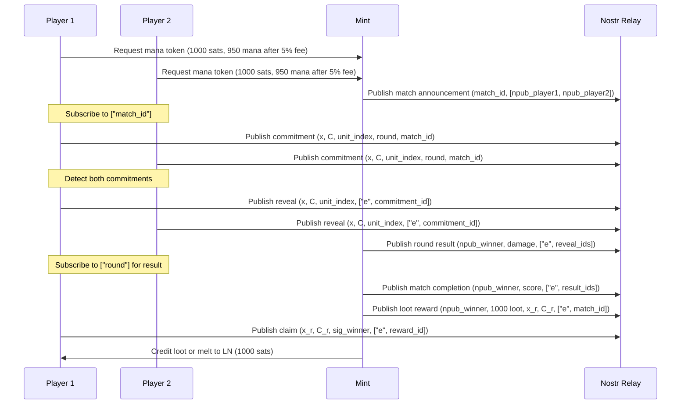

# Game System Specification: Mana Strategy Game with Cashu and Nostr

## 1. Overview
This document outlines the design and implementation requirements for “Mana Strategy,” a digital strategy game where players compete head-to-head using 32-byte sets of units encoded as “mana” tokens. The game leverages the Cashu protocol for issuing mana (gameplay currency) and “loot” (reward currency) via blinded signatures and locked tokens, and the Nostr protocol for asynchronous communication of match state, unit commitments, reveals, and reward claims. Players purchase mana tokens via Lightning Network (LN) with a fixed 5% mint fee, use them for gameplay, and cannot melt mana back to LN. Winners receive loot tokens, always locked to their Nostr public key (npub), which can be melted for LN or swapped between players. Matches are best-of-five rounds with a betting system for strategic depth and a Swiss-system tournament for competitive play. The system ensures cryptographic fairness, privacy, and asynchronous gameplay, targeting cross-platform deployment (web and mobile).

## 2. System Requirements
- **Platform**: Cross-platform, supporting web and mobile applications (iOS and Android).
- **Core Components**:
- Game engine for match and round resolution.
- Cashu protocol integration for mana and loot token minting, verification, melting, and swapping (NUT-00, NUT-01, NUT-02, NUT-03, NUT-04, NUT-05, NUT-07, NUT-11, NUT-20).
- Nostr protocol integration for asynchronous unit commitments, reveals, match state updates, and reward claims (NIP-01).
- Verifiable random function (VRF) for unit generation and fraud prevention.
- Tournament management system (Swiss-system format).
- User interface for mana purchase, unit selection, commitment/reveal submission, betting, loot claiming/swapping, and result verification.
- **Cryptographic Requirements**:
- Blind Diffie-Hellman Key Exchange (BDHKE) for blinded signatures, using secp256k1 curve (NUT-00).
- SHA-256 for hashing secrets, VRF outputs, unit commitments, and locked token conditions.
- Up to 16 private/public key pairs per active keyset for “leagues” (NUT-01, NUT-02).
- Nostr event signing with secp256k1 keys (NIP-01).
- Locked loot tokens tied to winner’s npub (converted to secp256k1 public key) (NUT-11).
- **Performance**:
- Matches resolve within 30 seconds per round.
- Token minting and unblinding complete in under 2 seconds.
- VRF verification completes in under 1 second per submission.
- Nostr event publishing and retrieval complete in under 1 second.
- Loot issuance and claiming complete in under 2 seconds.
- **Scalability**: Support up to 32 players per tournament, with a single Nostr relay for initial implementation.

## 3. Cashu Protocol Integration
The game uses the Cashu protocol to issue mana tokens (for gameplay) and loot tokens (for rewards). Mana is purchased via LN with a 5% fee and is non-meltable. Loot is always locked to the winner’s npub, meltable for LN, and swappable between players.

### 3.1 Mana Token Structure
- **Definition**: A mana token is an ecash token with an unblinded signature (C) and secret (x) pair, forming a 32-byte unit set (256 bits), divided into eight 4-byte units (see Section 5.1).
- **Keysets and Leagues**:
- The mint maintains one active keyset with up to 16 private keys, each tied to a “league” (e.g., Fire, Ice, Shadow) (NUT-01, NUT-02).
- Each key corresponds to a league-specific modifier (e.g., Fire: +10 attack). Amount is fixed at 1 mana per token.
- **Token Issuance**:
- Players pay via LN with a 5% mint fee (NUT-04).
- Fee calculation: For S sats inbound, player receives M = S * 0.95 mana (e.g., 1000 sats yields 950 mana).
- Player generates a secret (x), blinds it (M'), and submits it with a quote ID (POST /v1/mint/quote/bolt11, NUT-20).
- Mint signs with a league-specific key (k_a) to produce C' = k_a * M', returns the blind signature (NUT-03).
- Player unblinds to obtain (x, C), mapping to a 32-byte unit set.
- **Privacy**: Blinded signatures ensure the mint cannot link tokens to players or gameplay (NUT-00).
- **Deterministic Secrets**: Secrets (x) and blinding factors (r) are derived from a BIP39 mnemonic seed and BIP32 path, with a counter per keyset (NUT-13).
- **Non-Meltable**: Mana tokens cannot be redeemed for LN, ensuring gameplay-only use.

### 3.2 Loot Token Structure
- **Definition**: A loot token is an ecash token issued as a reward, always locked to the winner’s Nostr public key (npub, converted to secp256k1 public key), meltable for LN (NUT-05), and swappable between players (NUT-03) (NUT-11).
- **Issuance**:
- After determining the winner (Section 4.4), the mint issues a loot token: (x_r, C_r), where C_r = k_r * hash_to_curve(x_r || npub_winner).
- Reward amount: 1000 loot per match win, or 5000 loot for tournament winner.
- **Melting**:
- Winner submits (x_r, C_r, sig_winner) to melt loot for LN (POST /v1/melt/bolt11, NUT-05).
- Mint verifies: k_r * hash_to_curve(x_r || npub_winner) == C_r and validates sig_winner (signed with winner’s Nostr private key).
- **Swapping**:
- Players swap loot tokens via POST /v1/swap (NUT-03), preserving the lock to npub_winner.
- Only the owner of npub_winner can melt swapped tokens.
- **Locking Requirement**: Every loot token is locked to npub_winner at issuance, ensuring only the winner (or their private key holder) can claim or melt it.

### 3.3 Token Purchase and Fee
- **Mana Purchase**:
- Request quote (POST /v1/mint/quote/bolt11, NUT-04).
- Mint issues a Lightning invoice for S sats, yielding M = S * 0.95 mana (e.g., 1000 sats yields 950 mana, 50 sats fee).
- Player pays, submits blinded message (M') with quote ID (POST /v1/mint/bolt11, NUT-20).
- Mint returns blind signature (C'), unblinded to obtain (x, C).
- **Fee Structure**:
- Fixed 5% fee on inbound sats for mana purchases, non-adjustable for fairness.
- Fee retained by mint, logged transparently.
- **Loot Redemption**:
- Loot tokens redeemed for LN (NUT-05) or swapped (NUT-03).
- No fee for melting loot; full amount paid out.

## 4. Nostr Protocol Integration
Nostr enables asynchronous unit selection, match state updates, and reward claiming via a single relay (NIP-01). Events are linked for traceability.

### 4.1 Mint Match Announcement
- **Trigger**: Mint infers a game is active when two players request mana tokens for the same `match_id`.
- **Mechanism**:
- Upon issuing tokens (Section 3.1), mint publishes:
```json
{
"kind": 1,
"content": {"match_id": match_id, "players": [npub_player1, npub_player2], "round": tournament_round},
"tags": [["match_id", match_id], ["tournament_round", tournament_round]],
"pubkey": mint_npub,
"created_at": timestamp,
"id": match_event_id,
"sig": signature
}
```
- Published to wss://relay.example.com.
- Players subscribe to `["match_id", match_id]` to confirm.

### 4.2 Unit Commitment Scheme
- **Purpose**: Asynchronous unit selection without revealing units until both commit.
- **Mechanism**:
- Players select one unit (0-7) from their 32-byte set.
- Compute commitment: `commitment = SHA-256(x || C || unit_index || round_number || match_id)`.
- Publish commitment event:
```json
{
"kind": 1,
"content": commitment,
"tags": [["match_id", match_id], ["round", round_number]],
"pubkey": npub_player,
"created_at": timestamp,
"id": commitment_event_id,
"sig": signature
}
```
- Players subscribe to `["match_id", match_id], ["round", round_number]`.

### 4.3 Unit Reveal
- **Trigger**: Both players’ commitment events published.
- **Mechanism**:
- Publish reveal event:
```json
{
"kind": 1,
"content": {"x": secret, "C": signature, "unit_index": unit_index},
"tags": [["match_id", match_id], ["round", round_number], ["e", commitment_event_id]],
"pubkey": npub_player,
"created_at": timestamp,
"id": reveal_event_id,
"sig": signature
}
```
- Game engine verifies: `SHA-256(x || C || unit_index || round_number || match_id) == commitment`.
- Invalid commitments result in a default round loss.

### 4.4 Match State Updates and Winner Determination
- **Round Results**:
- After reveals, game engine computes outcome (Section 5.2) and publishes:
```json
{
"kind": 1,
"content": {"winner": npub_winner or "tie", "damage_dealt": [player1_damage, player2_damage]},
"tags": [["match_id", match_id], ["round", round_number], ["e", reveal_event_id_1], ["e", reveal_event_id_2]],
"pubkey": mint_npub,
"created_at": timestamp,
"id": result_event_id,
"sig": signature
}
```
- **Match Completion**:
- After five rounds, mint determines winner (most round wins, tiebreaker: total damage dealt).
- Publish match completion event:
```json
{
"kind": 1,
"content": {"winner": npub_winner, "score": [player1_rounds_won, player2_rounds_won], "total_damage": [player1_damage, player2_damage]},
"tags": [["match_id", match_id], ["e", result_event_id_1], ["e", result_event_id_5]],
"pubkey": mint_npub,
"created_at": timestamp,
"id": match_event_id,
"sig": signature
}
```

### 4.5 Reward Claiming
- **Trigger**: Match completion event published, winner determined.
- **Mechanism**:
- Mint issues a locked loot token (NUT-11): (x_r, C_r), where C_r = k_r * hash_to_curve(x_r || npub_winner).
- Reward amount: 1000 loot per match win, 5000 loot for tournament winner.
- Mint publishes reward event:
```json
{
"kind": 1,
"content": {"winner": npub_winner, "amount": reward_amount, "x_r": reward_secret, "C_r": reward_signature},
"tags": [["match_id", match_id], ["e", match_event_id], ["reward"]],
"pubkey": mint_npub,
"created_at": timestamp,
"id": reward_event_id,
"sig": signature
}
```
- Winner submits claim event:
```json
{
"kind": 1,
"content": {"x_r": reward_secret, "C_r": reward_signature, "sig_winner": signature},
"tags": [["match_id", match_id], ["e", reward_event_id], ["claim"]],
"pubkey": npub_winner,
"created_at": timestamp,
"id": claim_event_id,
"sig": signature
}
```
- Mint verifies: k_r * hash_to_curve(x_r || npub_winner) == C_r and sig_winner (signed with winner’s Nostr private key).
- On success, mint credits loot to winner’s wallet or melts to LN (NUT-05).
- **Timeout**: If winner fails to claim within 24 hours, reward is forfeited to the tournament prize pool.
- **Swapping**: Players can swap loot tokens via POST /v1/swap (NUT-03), preserving the lock to npub_winner.

### 4.6 Nostr Relay
- **Single Relay**: Use wss://relay.example.com.
- **Operations**:
- Players and mint publish/subscribe to events with `["match_id", match_id]`, `["round", round_number]`, `["reward"]`, or `["claim"]` tags.
- Relay retains events for 24 hours post-match for verification and claiming.
- **Security**:
- Events signed with secp256k1 keys (NIP-01).
- Relay enforces valid `id` and `sig`.

### 4.7 Nostr Event Flow (Mermaid Diagram)


## 5. Game Mechanics

### 5.1 Unit Structure
- Each mana token yields a 32-byte set, divided into eight 4-byte units:
- Byte 1: Attack (integer, 0-255).
- Byte 2: Defense (integer, 0-255).
- Byte 3: Health (integer, 0-255).
- Byte 4: Ability (integer, 0-3).
- **Abilities**:
- 0: None.
- 1: Boost (doubles attack this round).
- 2: Shield (negates damage this round).
- 3: Heal (restores 50% max health, rounded up, post-combat).
- **League Modifiers**:
- Determined by the signing key (k_a), e.g., Fire League: +10 attack, Ice League: +20 health.

### 5.2 Match Structure
- **Matches**: One-on-one, best-of-five rounds, asynchronous via Nostr.
- **Round Mechanics**:
- Players commit to a unit via Nostr (Section 4.2).
- After commitments, players reveal units (Section 4.3).
- Combat resolution:
- Unit A’s attack minus Unit B’s defense equals damage to B’s health (and vice versa).
- Minimum damage is 0. Health reaching 0 eliminates the unit.
- Abilities and league modifiers apply.
- Round winner: Unit with health > 0, or higher remaining health. Ties award no points.
- **Scoring**:
- 1 point per round won.
- Match winner: Most round wins. Tiebreaker: Total damage dealt.

### 5.3 Betting System
- **Pre-Match**:
- Players submit a percentage bet (0-100) via Nostr event (kind: 1, tagged with `["match_id", match_id], ["bet"]`, content: `"bet_percentage"`).
- Bets revealed after unit sets issued.
- **Turn Order**:
- Higher bettor chooses first or last in round one.
- Turn order alternates each round.
- Tiebreaker: Highest attack value across units.
- **Betting Impact**:
- Accurate bets (within 10% of win rate) award 0.5 points per percentage point.
- Example: Bet 80%, win 4/5 rounds (80%), gain 4 + (0.5 * 10) = 9 points.

### 5.4 Fraud Prevention
- **Unit Generation**:
- Mint generates 32-byte set via VRF: Hash(seed || k_a), with seed = tournament_id || match_id || npub_player || league_id.
- **Post-Match Verification**:
- Players submit (x, C, unit_indices) for all rounds via Nostr event (kind: 1, tagged with `["match_id", match_id], ["verification"]`) within 10 minutes.
- Mint verifies k_a * hash_to_curve(x) == C (NUT-07) and commitment matches.
- Outcomes:
- Valid submissions: Match results finalized.
- Invalid/non-submitted: Player disqualified, opponent wins.
- **Implementation**:
- Use libsecp256k1 for BDHKE and SHA-256 for hashing (NUT-00, NUT-11).
- Nostr events logged for auditability.

## 6. Tournament Structure
- **Format**: Swiss-system, 6-8 rounds, 16-32 players.
- **Pairing**: Similar win-loss records, no repeat matchups until finals.
- **Unit Issuance**:
- Players request mana tokens (1000 sats = 950 mana), specifying a league.
- Fresh token per match, issued via Cashu mint.
- **Scoring**:
- 10 points per match win.
- Betting accuracy bonuses (Section 5.3).
- **Advancement**:
- Top 4 or 8 players to single-elimination bracket.
- **Payouts**:
- Paid in loot tokens, locked to npub_winner (NUT-11).
- Requires valid verification (NUT-07). Non-submission within 10 minutes results in default win.

## 7. Example Unit Sets
### Unit Set 1 (Player A, Fire League, +10 attack)
| Unit | Attack | Defense | Health | Ability |
|------|--------|---------|--------|---------|
| 1 | 100 (+10) | 80 | 120 | 0 (None) |
| 2 | 150 (+10) | 50 | 100 | 1 (Boost) |
| 3 | 70 (+10) | 90 | 110 | 2 (Shield) |
| 4 | 120 (+10) | 100 | 80 | 3 (Heal) |
| 5 | 90 (+10) | 120 | 90 | 0 (None) |
| 6 | 200 (+10) | 30 | 70 | 1 (Boost) |
| 7 | 60 (+10) | 110 | 130 | 2 (Shield) |
| 8 | 110 (+10) | 70 | 100 | 3 (Heal) |

### Unit Set 2 (Player B, Ice League, +20 health)
| Unit | Attack | Defense | Health | Ability |
|------|--------|---------|--------|---------|
| 1 | 80 | 100 | 110 (+20) | 0 (None) |
| 2 | 130 | 60 | 90 (+20) | 1 (Boost) |
| 3 | 90 | 80 | 120 (+20) | 2 (Shield) |
| 4 | 110 | 90 | 100 (+20) | 3 (Heal) |
| 5 | 70 | 110 | 80 (+20) | 0 (None) |
| 6 | 160 | 40 | 100 (+20) | 1 (Boost) |
| 7 | 50 | 120 | 110 (+20) | 2 (Shield) |
| 8 | 100 | 80 | 90 (+20) | 3 (Heal) |

### Example Round with Commitments and Reward
- **Round 1**:
- Player A commits to Unit 2: `commitment_A = SHA-256(x_A || C_A || 2 || 1 || match_id)`, publishes event.
- Player B commits to Unit 3: `commitment_B = SHA-256(x_B || C_B || 3 || 1 || match_id)`, publishes event.
- Both reveal (x, C, unit_index) with `["e", commitment_event_id]`.
- Combat: A’s Unit 2 (170 attack, Boost: 340) vs. B’s Unit 3 (90 attack, Shield). B takes 0 damage, A takes 10. B wins.
- Mint publishes result event with `["e", reveal_event_id_A], ["e", reveal_event_id_B]`.
- **Match End**: Player B wins 3/5 rounds. Mint publishes match completion and loot reward event (1000 loot, locked to npub_B).
- **Claim**: Player B submits claim event with sig_winner, mint verifies and credits 1000 loot or melts to 1000 sats.

## 8. Future Expansion
- **Magic-like Combos**: Pair-based bonuses, type-based counters, dynamic abilities.
- **Multi-Relay Nostr**: Support multiple relays (NIP-01).
- **Encrypted Communication**: Use NIP-04 for private match/reward coordination.
- **Advanced Leagues**: Unique abilities per league.
- **Complex Rewards**: Tiered loot amounts based on tournament rank.

## 9. Deliverables
- **Game Engine**: Automated match resolution with asynchronous commitments.
- **Cashu Mint**: NUT-00, NUT-01, NUT-02, NUT-03, NUT-04, NUT-05, NUT-07, NUT-11, NUT-20.
- **Nostr Integration**: Event publishing/subscription for announcements, commitments, reveals, results, and rewards (NIP-01).
- **Tournament System**: Swiss-system pairing and scoring.
- **User Interface**: Web/mobile interfaces for mana purchase, unit selection, commitment/reveal, betting, loot claiming/swapping, and verification.
- **Documentation**: User manual, developer API, Cashu/Nostr compliance guide.

## 10. Timeline (Waterfall Phases)
- **Phase 1: Requirements & Design** (2 weeks)
- Finalize specification, UI mockups, Cashu/Nostr integration plan.
- **Phase 2: Core Development** (8 weeks)
- Build game engine, Cashu mint, Nostr client, VRF module, reward system, UI.
- **Phase 3: Tournament System** (4 weeks)
- Implement Swiss-system pairing and scoring.
- **Phase 4: Testing & Refinement** (4 weeks)
- Stress-test Cashu, Nostr, combat, rewards, and UI.
- **Phase 5: Deployment** (2 weeks)
- Launch on web and mobile platforms.

## 11. References
- Cashu NUTs: https://cashubtc.github.io/nuts/
- Nostr NIPs: https://github.com/nostr-protocol/nips
- Blind Signature Scheme: https://blog.cashu.space/posts/buckets-of-blind-signatures
